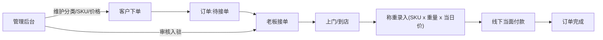
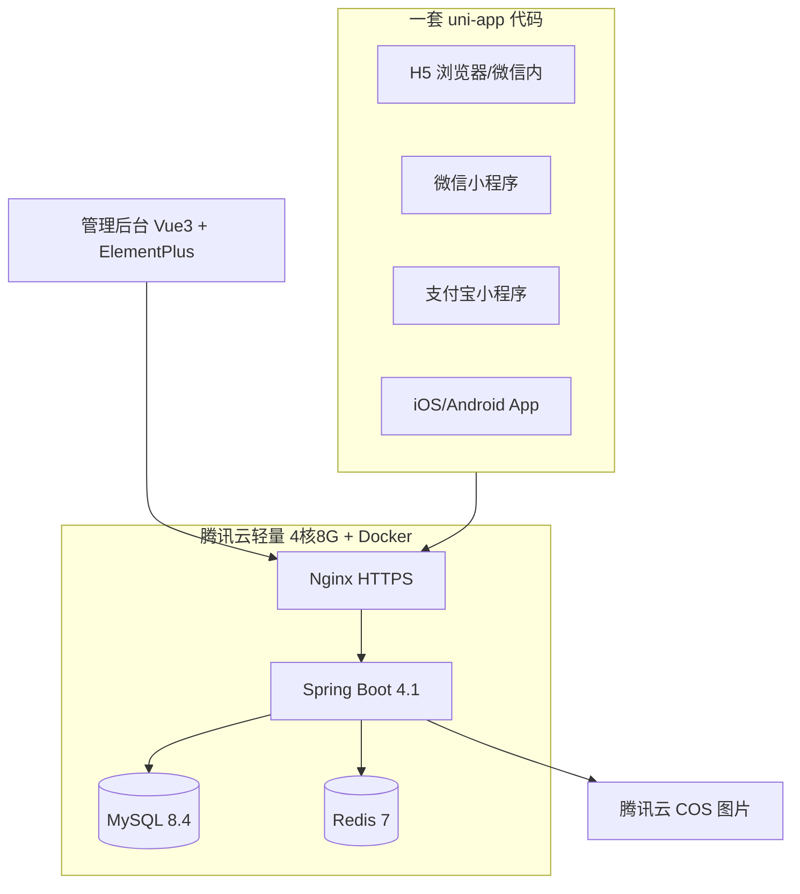

# 垃圾回收平台启动方案(调研 + 选型 + 环境 + 部署)

本地联调入口见 **[docs/00-落地实现总方案.md](docs/00-落地实现总方案.md)**。

| 服务 | 命令 | 地址 |
| --- | --- | --- |
| 后端 | `cd backend && mvn -q -DskipTests package && java -jar recycle-admin-api/target/backend.jar` | http://127.0.0.1:8080 |
| 管理后台 | `cd admin-web && pnpm dev` | http://127.0.0.1:5173 admin / Admin@123 |
| C/B 端 H5 | `cd app-uni && pnpm run dev:h5` | http://127.0.0.1:5174 验证码 123456 |

## 一、需求调研结论

### 角色与功能清单

**客户端(C端,uni-app 内按角色展示)**

- 首页:定位城市、Banner、回收品类入口、环保资讯
- 查价:分类 -> SKU -> 今日回收价(管理后台维护)
- 上门回收:选品类/预估重量/拍照 -> 选地址 -> 约时间段 -> 下单
- 到店回收:地图/列表查附近回收站,查看营业信息、导航
- 订单:待接单/服务中/已完成/已取消,称重明细与金额
- 我的:微信/支付宝授权登录 + 手机号,地址管理;钱包提现暂不做(资金线下当面结算,表结构预留)

**回收站老板端(B端,同一 uni-app,登录后按角色切换 tabBar 与页面分包)**

- 工作台:今日订单数/金额统计
- 接单大厅:附近新订单,接单/抢单
- 订单处理:上门 -> 按 SKU 录入实际重量,自动按当日价格计算金额 -> 拍照留证 -> 标记线下已付款完成
- 门店管理:回收站信息、营业状态、可回收品类

**管理后台(Web)**

- 垃圾分类管理:两级分类(可回收物/金属/纸类/塑料/电器…),图标、排序、启停
- SKU 管理:分类下的 SKU(名称/图片/计量单位/状态)
- 回收价格维护:SKU 指导价、调价记录、生效时间(预留城市差异化定价)
- 回收站管理:入驻审核、信息维护、账号启停
- 用户管理、订单管理(全量查询/异常处理)
- 内容管理:Banner、公告
- 系统管理:管理员、角色权限(RBAC)、操作日志;数据看板

### 核心数据模型(MySQL)

`user`(含 role:customer/recycler)、`recycle_station`、`category`(两级)、`sku`、`sku_price` + `sku_price_log`、`recycle_order` + `order_item`(下单预估 + 称重实收双份数据)、`user_address`、`banner`、`sys_admin/sys_role/sys_menu/sys_log`

### 业务流程




## 二、技术选型(定稿)

- **多端应用**:uni-app 3.x(Vue3 + Vite + TypeScript + Pinia),UI 用 wot-design-uni;一套代码编译 H5 / 微信小程序 / 支付宝小程序 / iOS / Android(HBuilderX 云打包,原生混合渲染,非纯 WebView 套壳,规避 App Store 4.3 与小程序 web-view 主体限制)
- **管理后台**:Vue3 + Vite + TypeScript + Element Plus + Pinia
- **后端**:Spring Boot 4.1.x + JDK 21 + MyBatis-Plus + Sa-Token(登录/RBAC)+ Knife4j 接口文档;单体分模块(admin-api / app-api / common)
- **存储**:MySQL 8.4 + Redis 7;图片传腾讯云 COS
- **部署**:Docker Compose(mysql/redis/backend)+ Nginx(H5 静态、管理后台静态、API 反代、HTTPS)




## 三、环境准备

**本地开发环境**(会检测并给出安装指引):JDK 21、Maven、Node 20+ LTS、pnpm、Docker Desktop、HBuilderX(App 打包必需)、微信开发者工具、支付宝小程序 IDE

**账号资质清单(需你操作的放 docs 文档,按办理时长排序)**

- 尽快启动:营业执照(个体户/公司,上线硬门槛)-> 软著申请(自办免费约 2 个月,App 商店上架需要)
- 第 1 周:腾讯云账号 + 域名(.com 约 60 元/年,需实名)+ 轻量服务器 4核8G(新用户约 450-880 元/年,备案要求包年包月>=90 天)-> 立即提交 ICP 备案(免费,3-22 个工作日,期间不影响开发)
- 备案通过后:微信小程序注册(企业认证 300 元/年)+ 小程序备案;支付宝小程序(企业认证免费)+ 备案;App 备案(包名/公钥/签名 MD5)+ 上架后 30 日内公安备案
- App 阶段:苹果开发者账号($99/年)、华为/小米/OPPO/vivo/应用宝开发者账号

**首年费用估算**:约 2000-2800 元(域名 60 + 服务器 450-880 + 微信认证 300 + 苹果 720 + COS/杂项 100-300;软著自办免费)

## 四、服务器部署与域名方案

- 域名规划:`example.com` 主域,`h5.example.com`(H5)、`admin.example.com`(管理后台)、`api.example.com`(接口)、`cdn.example.com`(COS 加速,可选)
- HTTPS:acme.sh 自动签发续期(免费证书现均为 90 天有效,必须自动化),小程序强制 HTTPS
- 部署产物:`deploy/` 目录含生产 docker-compose.yml、Nginx 配置、一键部署脚本、数据库备份脚本;文档含从买服务器到上线的逐步操作指引
- 发布路径:H5 部署即上线;微信/支付宝小程序走各自 IDE 上传提审;App 用 HBuilderX 云打包 -> 安卓各商店提审 / iOS App Store Connect 提审

## 五、本阶段交付物与工程结构

```
GC/
├── docs/            # 00联调手册 01需求调研 02技术选型 03账号与备案 04部署 05库表 06接口 07前端
├── backend/         # Spring Boot 4.1 后端骨架(可运行,含登录+RBAC+示例CRUD)
├── admin-web/       # 管理后台骨架(可运行,登录+布局+菜单)
├── app-uni/         # uni-app 骨架(可运行,登录+角色分包+四端编译通过)
├── deploy/          # docker-compose(本地/生产)、nginx、部署脚本
└── README.md
```

## 六、后端启动说明(backend/)

**模块**:`recycle-common`(实体/Mapper/统一响应/Sa-Token/配置) → `recycle-app-api`(/app-api C端+B端) → `recycle-admin-api`(/admin-api + 唯一启动类 `RecycleApplication`)。

**前置**:JDK 21、Maven 3.8+;本机 MySQL(127.0.0.1:3306,库 `recycle`,账号 `recycle`/`recycle@Dev123`)与 Redis(127.0.0.1:6379 无密码)已就绪;首次需导入 SQL:

```bash
mysql -h127.0.0.1 -urecycle -p'recycle@Dev123' recycle < backend/sql/01-schema.sql
mysql -h127.0.0.1 -urecycle -p'recycle@Dev123' recycle < backend/sql/02-seed.sql
```

**构建与启动**(默认 profile=local,连接配置在 `recycle-admin-api/src/main/resources/application-local.yml`):

```bash
cd backend
mvn -q -DskipTests package
java -jar recycle-admin-api/target/backend.jar
```

- 健康检查:`http://localhost:8080/actuator/health`
- 接口文档:`http://localhost:8080/doc.html`(分组 admin-api / app-api,生产请关闭)
- 种子账号:后台 `admin` / `Admin@123`;C端 `13800000001`、B端 `13800000002`(短信验证码 mock 固定 `123456`)
- 鉴权:请求头 `Authorization: {token}`(无 Bearer);响应 `{code,msg,data,ts}`,`code=0` 成功,未登录 `40100`
- Docker:`backend/Dockerfile`(eclipse-temurin:21-jre-jammy,jar 复制为 /app/app.jar)

## 风险提示

- 个人主体无法上线经营类小程序,营业执照是关键路径,建议本周启动办理
- 回收站线下经营需向商务部门做"再生资源回收经营者备案"(老板侧合规,平台入驻审核时提示)
- 若未来做线上钱包/提现,需企业商户号且"企业付款到零钱"有开通门槛,当前先线下结算是正确起步方式

