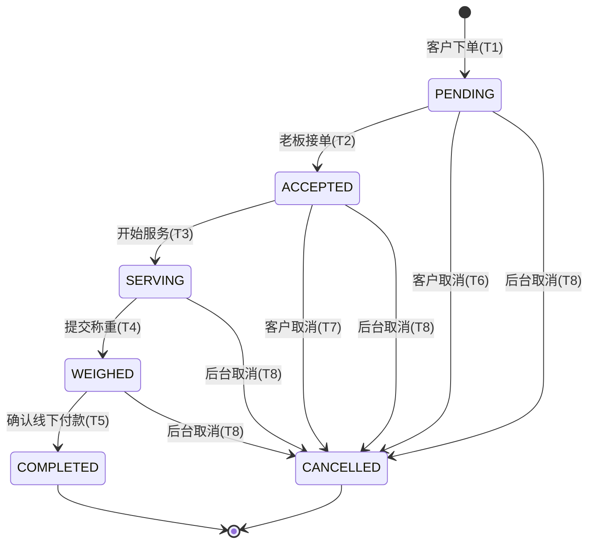

# 垃圾回收平台 需求调研文档

> 存放路径:`docs/01-需求调研.md`

---

## 0. 文档信息

| 项目 | 内容 |
| --- | --- |
| 文档名称 | 垃圾回收平台需求调研文档 |
| 版本 | v1.0(定稿) |
| 适用读者 | 产品、前端(uni-app / Web)、后端、测试、运维 |
| 技术前提 | C端与B端共用一套 uni-app 代码(按角色切换 tabBar 与分包);管理后台为独立 Web;数据库 MySQL |
| 关键约束 | 钱包提现本期不做(表结构预留);城市差异化定价只预留字段不实现;付款为线下当面结算 |

### 0.1 术语表

| 术语 | 定义 |
| --- | --- |
| C端 | 客户端,面向卖废品的普通用户(customer) |
| B端 | 回收站老板端,面向入驻回收站的经营者(recycler) |
| SKU | 可回收物的最小计价单位,如「废纸箱」「易拉罐」,挂在二级分类下 |
| 指导价 | 管理后台维护的 SKU 当日回收单价,C端查价与订单计价的依据 |
| 预估数据 | 客户下单时填写的品类与预估重量 |
| 实收数据 | 老板上门/到店称重后录入的实际重量与按当日价计算的金额 |
| 抢单 | 附近多个回收站均可见新订单,先接单者得 |

---

## 1. 项目概述与目标

### 1.1 业务背景

平台连接「有可回收物的居民/商户」与「回收站」,解决三个问题:

1. 客户不知道废品值多少钱 → 提供官方每日回收价查询;
2. 客户不知道找谁回收 → 提供上门回收下单、到店回收导航;
3. 回收站获客难 → 提供接单大厅与门店曝光。

### 1.2 业务闭环(本期)

```
客户下单(选SKU+预估重量+拍照+地址+时间段)
 → 订单进入待接单池
 → 附近回收站老板接单/抢单
 → 上门(或客户到店)
 → 老板按 SKU 录入实际重量,系统按当日价自动算金额
 → 拍照留证
 → 线下当面付款,老板标记完成
 → 订单完成
```

管理后台负责:分类/SKU/价格维护(供给C端查价与计价)、回收站入驻审核(供给B端登录经营)、全量订单与用户管理、内容运营。

### 1.3 成功指标(上线后观测,不作为验收项)

| 指标 | 说明 |
| --- | --- |
| 下单转化率 | 进入下单页 → 成功创建订单 |
| 接单时长 | 订单创建 → 被接单的平均耗时 |
| 订单完成率 | 已接单订单中最终完成的比例 |
| 取消率与取消原因分布 | 用于优化时间段与调度规则 |

---

## 2. 角色与权限

### 2.1 角色定义

| 角色 | 编码 | 所属端 | 获得方式 | 说明 |
| --- | --- | --- | --- | --- |
| 游客 | guest | C端 | 无需登录 | 可浏览首页、查价、看附近回收站;下单/订单/我的需登录 |
| 客户 | customer | C端 | 微信/支付宝授权登录+绑定手机号,默认角色 | 下单、管理地址、查看自己的订单 |
| 回收站老板 | recycler | B端 | 客户提交入驻申请 → 管理后台审核通过后角色升级 | 接单、称重录入、完成订单、维护门店 |
| 平台管理员 | admin | 管理后台 | 由超级管理员在系统管理中创建 | 按 RBAC 分配菜单/按钮权限 |
| 超级管理员 | super_admin | 管理后台 | 初始化内置账号 | 拥有全部权限,不可被禁用/删除 |

> 说明:`user.role` 取值 customer/recycler。同一微信用户审核通过后角色变为 recycler,登录小程序后 tabBar 切换为 B 端;若需要以客户身份下单,本期不支持双角色切换(见「不做范围」)。

### 2.2 权限矩阵(功能级)

| 功能 | guest | customer | recycler | admin(按RBAC) | super_admin |
| --- | :-: | :-: | :-: | :-: | :-: |
| 浏览首页/查价/附近回收站 | ✅ | ✅ | ✅ | — | — |
| 创建上门回收订单 | ❌(引导登录) | ✅ | ❌ | — | — |
| 取消自己的订单(限定状态) | ❌ | ✅ | ❌ | — | — |
| 地址管理 | ❌ | ✅ | ❌ | — | — |
| 提交入驻申请 | ❌ | ✅ | ❌(已是老板) | — | — |
| 接单/抢单 | ❌ | ❌ | ✅(门店审核通过且营业中) | — | — |
| 称重录入/标记完成 | ❌ | ❌ | ✅(仅本店订单) | — | — |
| 门店信息维护 | ❌ | ❌ | ✅(仅本店) | ✅ | ✅ |
| 分类/SKU/价格维护 | ❌ | ❌ | ❌ | ✅ | ✅ |
| 入驻审核 | ❌ | ❌ | ❌ | ✅ | ✅ |
| 用户/订单全量管理 | ❌ | ❌ | ❌ | ✅ | ✅ |
| Banner/公告管理 | ❌ | ❌ | ❌ | ✅ | ✅ |
| 管理员/角色/菜单/日志 | ❌ | ❌ | ❌ | 部分(看角色) | ✅ |

### 2.3 数据权限规则

| 角色 | 数据范围 |
| --- | --- |
| customer | 仅本人订单、本人地址、本人资料 |
| recycler | 接单大厅可见「附近且待接单」订单的脱敏摘要(品类、预估重量、距离、时间段、地址仅到街道级);接单后可见完整地址与客户手机号;订单列表仅本店订单 |
| admin | 全量数据,操作留痕写入 sys_log |

### 2.4 管理后台 RBAC 要求

- 三层模型:`sys_admin`(管理员) ↔ `sys_role`(角色) ↔ `sys_menu`(菜单+按钮权限点)。
- 权限点粒度到按钮,如 `price:edit`、`station:audit`、`order:cancel`。
- 后端接口必须做权限校验,不能只靠前端隐藏按钮。
- 所有写操作(新增/修改/删除/审核/调价)记录操作日志:操作人、时间、IP、接口、请求参数摘要、结果。

---

## 3. 功能清单

### 3.1 C端(客户,uni-app 主包 + 客户分包)

| 编号 | 功能 | 入口 | 页面 | 关键交互 | 验收标准 |
| --- | --- | --- | --- | --- | --- |
| C-01 | 城市定位展示 | 首页顶部 | 首页 | 进入首页请求定位授权;成功→逆地理解析出城市名;失败→显示默认城市并可手动点击(本期城市仅展示,不影响价格) | 授权成功2秒内展示城市;拒绝授权显示默认城市且不阻塞页面;不重复弹授权框 |
| C-02 | Banner 轮播 | 首页 | 首页 | 自动轮播,点击按跳转类型(无跳转/内部页面/富文本详情)跳转 | 仅展示状态=启用且在生效时间内的 Banner,按 sort 升序;无数据时区域隐藏不留白 |
| C-03 | 回收品类入口 | 首页金刚区 | 首页 → 查价页 | 展示一级分类图标(启用状态,按排序);点击进入查价页并定位到该分类 | 分类图标与后台配置一致;停用分类不显示 |
| C-04 | 环保资讯/公告 | 首页资讯区 | 首页 → 公告详情 | 列表展示启用中的公告标题,点击进入富文本详情 | 富文本正常渲染图片与段落;下线公告立即不可见 |
| C-05 | 查价 | 首页金刚区/tabBar「查价」 | 查价页 | 左侧一级分类,右侧该分类下二级分类分组的 SKU 列表,展示「名称+图片+今日价/单位」;支持关键字搜索 SKU | 价格与后台当前生效价一致;停用 SKU 不显示;无价格的 SKU 显示「暂无报价」且不可下单勾选 |
| C-06 | 上门回收下单 | 首页主按钮/查价页「卖了换钱」 | 下单页 | ① 勾选 SKU 并填写预估重量(每项>0);② 拍照上传1~6张;③ 选择地址(默认地址预选,可跳地址簿);④ 选择上门日期+时间段(今日已过时段不可选);⑤ 展示预估金额=Σ(预估重量×今日价);⑥ 提交创建订单 | 未登录点击提交→跳登录;必填项缺失时按钮置灰并提示;提交成功跳订单详情;订单同时保存预估明细与下单时价格快照 |
| C-07 | 到店回收(附近回收站) | 首页入口/tabBar | 回收站地图/列表页 | 地图模式展示附近回收站标点;列表模式按距离升序;点击查看详情:门店名、地址、营业时间、营业状态、可回收品类、电话;支持一键导航(唤起地图App)、拨打电话 | 仅展示审核通过且账号启用的回收站;距离计算误差可接受(直线距离);停业门店标灰但可查看 |
| C-08 | 订单列表 | tabBar「订单」 | 订单列表页 | Tab:全部/待接单/服务中/已完成/已取消;下拉刷新、上拉分页;卡片显示订单号、状态、品类摘要、预估/实收金额、时间 | 状态与后端一致;分页无重复无遗漏;空态有引导下单文案 |
| C-09 | 订单详情 | 订单列表卡片 | 订单详情页 | 展示状态进度条、预估明细、称重实收明细(称重后)、金额、照片、地址、时间段、接单门店与老板电话(接单后);待接单/已接单可「取消订单」(需选取消原因) | 称重前后明细分区展示清晰;取消按钮仅在合法状态出现;取消需二次确认 |
| C-10 | 登录/授权 | 「我的」或任意需登录动作 | 登录页 | 微信小程序端走微信授权,支付宝小程序端走支付宝授权;首次登录强制绑定手机号(微信手机号快捷授权,失败降级为短信验证码);登录后回到原页面 | 未绑定手机号不能下单;登录态过期自动静默刷新或引导重登;同一手机号跨微信/支付宝视为两个账号(本期不做打通,见不做范围) |
| C-11 | 地址管理 | 我的 → 地址管理;下单页选地址 | 地址列表页、地址编辑页 | 新增/编辑/删除地址;字段:联系人、手机号、地图选点(经纬度+省市区街道)+门牌详情、是否默认;删除需确认 | 手机号格式校验;必须完成地图选点(保证有经纬度);默认地址唯一;删除默认地址后不自动指定新默认 |
| C-12 | 我的(个人中心) | tabBar「我的」 | 我的页 | 头像昵称手机号;入口:地址管理、我的订单、入驻申请、关于我们、退出登录;钱包区块展示「余额(线下结算,暂不可提现)」占位 | 钱包不可点击进入任何提现流程;退出登录清除本地登录态 |
| C-13 | 回收站入驻申请 | 我的 → 「我要开回收站」 | 入驻申请页 | 填写:门店名、负责人、手机号、门店地图选点+详细地址、营业时间、可回收品类(勾选一级分类)、门店照片、资质照片;提交后状态「审核中」;被驳回可查看原因并重新提交 | 审核中不可重复提交;审核通过后下次登录自动切到B端;驳回原因原样展示 |

### 3.2 B端(回收站老板,同一 uni-app,recycler 角色分包)

| 编号 | 功能 | 入口 | 页面 | 关键交互 | 验收标准 |
| --- | --- | --- | --- | --- | --- |
| B-01 | 角色识别与tabBar切换 | 登录后 | 全局 | 登录接口返回 role=recycler 时,tabBar 切换为:工作台/接单大厅/订单/门店 | 客户账号看不到任何B端页面;B端账号被后台停用后接口返回403并强制登出 |
| B-02 | 工作台 | B端 tabBar 首位 | 工作台页 | 展示今日数据卡:新订单数、已完成单数、今日回收金额(实收合计)、进行中订单数;快捷入口:接单大厅、订单处理;显示门店营业状态开关(营业中/休息中) | 数据按自然日统计且与订单明细可对账;营业状态切换即时生效——休息中时接单大厅不再推送本店可接订单 |
| B-03 | 接单大厅 | tabBar | 接单大厅页 | 列表展示附近「待接单」订单:距离、品类与预估重量摘要、预估金额、期望时间段、街道级地址;下拉刷新;点击「接单」二次确认 | 订单被他人先接时,本人点击接单返回「订单已被抢」并从列表移除;休息中/未审核通过的门店无法接单;接单成功后订单出现在「订单处理」列表 |
| B-04 | 订单处理列表 | tabBar「订单」 | B端订单列表页 | Tab:待上门(已接单)/服务中/待收款(已称重)/已完成/已取消;卡片含客户联系电话(可拨打)、完整地址(可导航)、时间段 | 仅本店订单;状态实时正确;可从卡片直接拨号/导航 |
| B-05 | 开始服务 | 订单详情 | B端订单详情页 | 已接单订单点击「出发/开始服务」,状态变更为服务中 | 仅已接单状态可操作;操作人必须是接单门店 |
| B-06 | 称重录入 | B端订单详情 → 「称重」 | 称重录入页 | 默认带出客户预估的 SKU 行;每行录入实际重量(kg,两位小数);可增加客户未预估的 SKU(从本店可回收品类中选)、可将某行实收置0;单价自动取「当日生效价」并锁定为快照;实时显示每行小计与总金额;保存前可反复修改 | 金额=Σ round(重量×单价快照, 2);重量≤0的行不计入;提交后生成实收明细,状态变为已称重;提交后不可再改(改单走管理后台) |
| B-07 | 拍照留证 | 称重录入页/订单详情 | 同上 | 上传称重现场照片1~6张(必传至少1张) | 无照片不能提交称重;照片在C端订单详情可见 |
| B-08 | 标记线下已付款完成 | B端订单详情 | 同上 | 已称重订单点击「已当面付款,完成订单」,弹出金额确认(显示应付金额),确认后订单完成 | 仅已称重状态可完成;完成后订单进入已完成且双端明细一致;完成时间落库 |
| B-09 | 门店管理 | tabBar「门店」 | 门店信息页 | 查看/编辑:门店名、照片、电话、营业时间、地图位置、可回收品类勾选;营业状态开关 | 关键信息(名称/位置/资质)修改后进入「变更待审核」不影响原信息展示,审核通过后生效;营业时间与品类修改即时生效 |
| B-10 | 老板端「我的」 | 门店页内或独立 | 我的页 | 账号信息、联系客服、退出登录 | 退出后回到C端游客态登录页 |

### 3.3 管理后台(Web)

| 编号 | 功能 | 入口(左侧菜单) | 页面 | 关键交互 | 验收标准 |
| --- | --- | --- | --- | --- | --- |
| A-01 | 登录 | / | 登录页 | 账号+密码+图形验证码;连续失败5次锁定10分钟 | 密码错误不提示具体是账号还是密码错;登录成功写日志 |
| A-02 | 数据看板 | 首页 | 看板页 | 核心指标卡:今日订单数/完成数/回收金额/新增用户;近7日订单趋势折线;品类回收量占比饼图 | 数据与订单表可对账;无数据日期补0 |
| A-03 | 分类管理 | 商品 → 分类管理 | 分类列表页 | 两级树形/表格;新增/编辑(名称、图标、排序、父级)、启用/停用;一级分类停用则其下二级与SKU在C端整体不可见 | 名称同级唯一;停用有确认提示并说明影响范围;删除仅允许无下级且无SKU的分类 |
| A-04 | SKU 管理 | 商品 → SKU管理 | SKU列表页 | 按分类筛选;新增/编辑:名称、图片、所属二级分类、计量单位(kg/件)、排序、状态;启停 | SKU 必须挂在二级分类;停用后C端不可见、B端称重不可新增该SKU(已在订单中的历史数据不受影响) |
| A-05 | 回收价格维护 | 商品 → 价格管理 | 价格列表页、调价弹窗、调价记录页 | 列表展示每个SKU当前生效价与生效时间;调价:填写新单价+生效时间(立即或未来某时刻);每次调价写入 sku_price_log(旧价、新价、操作人、生效时间);支持查看单SKU历史调价曲线;城市字段预留(默认「全国」,界面暂不开放选择) | 未来生效的价格到点自动切换;同一SKU同一时间点仅一条生效价;调价不影响已称重订单(用快照);价格必须>0,单次涨跌幅超过50%需二次确认 |
| A-06 | 回收站入驻审核 | 回收站 → 入驻审核 | 审核列表页、审核详情页 | 待审核列表;详情查看全部申请材料;通过/驳回(驳回必填原因);通过后自动将该用户 role 升级为 recycler 并创建门店记录 | 审核动作写操作日志;驳回原因回显到B端申请页;重复提交覆盖旧申请材料 |
| A-07 | 回收站管理 | 回收站 → 门店管理 | 门店列表页、门店详情页 | 搜索/筛选(状态、城市);编辑门店信息;账号启用/停用(停用后老板无法登录B端功能);查看该店订单 | 停用即时生效(老板下次请求返回403);门店信息变更审核在此处理 |
| A-08 | 用户管理 | 用户 → 用户列表 | 用户列表页、用户详情页 | 按手机号/昵称/角色搜索;查看用户资料、地址、订单;禁用/启用账号(禁用需填原因) | 禁用用户无法登录与下单;敏感字段(手机号)列表页脱敏、详情页有权限者可见 |
| A-09 | 订单管理 | 订单 → 订单列表 | 订单列表页、订单详情页 | 多条件查询:订单号/手机号/状态/门店/时间范围;详情展示全部信息含预估与实收对照、照片、状态流转时间线;异常处理动作:后台取消订单(填原因)、称重明细修正(已称重未完成的订单,记录修改前后值) | 所有后台干预写日志并在订单时间线可见;已完成订单不可修改明细(只可备注) |
| A-10 | Banner 管理 | 内容 → Banner | Banner列表页、编辑弹窗 | 新增/编辑:图片(建议尺寸校验)、标题、跳转类型(无/内部页/富文本)、排序、生效起止时间、状态;启停;删除 | C端只显示启用且在生效期内的;排序即时生效 |
| A-11 | 公告管理 | 内容 → 公告 | 公告列表页、富文本编辑页 | 新增/编辑富文本公告,发布/下线,置顶 | 下线后C端立即不可见;富文本支持图片上传 |
| A-12 | 管理员管理 | 系统 → 管理员 | 管理员列表页 | 新增/编辑管理员(账号、姓名、密码、角色)、启停、重置密码 | 不能停用/删除 super_admin;密码强度校验(≥8位含字母数字) |
| A-13 | 角色权限 | 系统 → 角色管理 | 角色列表页、权限分配页 | 新增角色,勾选菜单树与按钮权限点保存 | 权限变更后该角色管理员刷新即生效;接口级校验同步生效 |
| A-14 | 操作日志 | 系统 → 操作日志 | 日志列表页 | 按操作人/模块/时间查询;只读 | 所有写操作可查到;日志不可删除不可编辑 |

---

## 4. 核心用户故事

验收采用 Given / When / Then 格式。

| 编号 | 用户故事 | 验收标准 |
| --- | --- | --- |
| US-01 | 作为客户,我想先查到废纸箱今天多少钱一公斤,以便决定要不要卖。 | Given 后台已为「废纸箱」设置生效价1.2元/kg;When 客户打开查价页;Then 「废纸箱」显示 1.2元/kg,与后台一致。 |
| US-02 | 作为客户,我想选好品类、拍照、填预估重量并预约明天上午上门,以便省事地卖废品。 | Given 客户已登录且有默认地址;When 完成选品(废纸箱预估10kg)、上传1张照片、选明天9:00-11:00并提交;Then 订单创建成功、状态=待接单,详情显示预估金额12.00元与价格快照。 |
| US-03 | 作为客户,我想在被接单前反悔取消,以便不浪费双方时间。 | Given 订单状态=待接单;When 客户点取消并选原因;Then 订单变为已取消,B端接单大厅不再展示该单。 |
| US-04 | 作为回收站老板,我想在接单大厅看到附近的新订单并抢单,以便获得生意。 | Given 门店审核通过且营业中,附近有一笔待接单订单;When 老板点击接单并确认;Then 订单状态=已接单且归属本店;此时另一老板对同一订单接单,收到「订单已被抢」。 |
| US-05 | 作为老板,我想按 SKU 录入实际重量后系统自动算钱,以便当面和客户对账。 | Given 订单服务中,废纸箱当日价1.2元/kg;When 录入实际重量8.5kg、上传称重照片并提交;Then 订单变为已称重,实收明细为 8.5kg × 1.2 = 10.20元,单价锁定为提交时刻生效价。 |
| US-06 | 作为老板,我当面付完现金后想一键完成订单,以便结束流程。 | Given 订单已称重,应付10.20元;When 老板点「已付款完成」并确认金额;Then 订单=已完成,C端详情同步显示实收明细与完成时间。 |
| US-07 | 作为运营,我想调整明天生效的回收价,以便应对行情波动。 | Given 废纸箱当前价1.2元;When 运营设置新价1.0元、生效时间为明日00:00;Then 今日查价与计价仍为1.2元,明日00:00后为1.0元,调价记录含操作人与新旧价。 |
| US-08 | 作为运营,我想审核入驻申请并驳回材料不全的申请,以便控制门店质量。 | Given 有一条待审核申请;When 运营驳回并填写原因「缺少营业执照照片」;Then 申请人B端入口显示驳回原因,可修改后重新提交;操作日志留痕。 |
| US-09 | 作为客户,我想找到最近的回收站并导航过去,以便直接到店卖。 | Given 客户授权定位,附近有2家营业中门店;When 打开附近回收站列表;Then 按距离升序展示,点导航成功唤起地图App。 |
| US-10 | 作为运营,我想处理一笔称错重量的订单,以便纠正纠纷。 | Given 订单已称重未完成,老板反馈多录了2kg;When 运营在订单详情修正明细并填原因;Then 金额重算,修改前后值记录在订单时间线与操作日志。 |

---

## 5. 订单状态机

### 5.1 状态定义

| 状态码 | 状态名 | 说明 | C端展示 | B端展示 |
| --- | --- | --- | --- | --- |
| `PENDING` | 待接单 | 客户下单成功,进入接单池 | 待接单 | 接单大厅可见 |
| `ACCEPTED` | 已接单 | 某门店接单成功,锁定归属 | 服务中(合并展示) | 待上门 |
| `SERVING` | 服务中 | 老板点击「开始服务/出发」 | 服务中 | 服务中 |
| `WEIGHED` | 已称重 | 实收明细提交,金额锁定 | 服务中(显示称重明细) | 待收款 |
| `COMPLETED` | 已完成 | 老板确认线下已付款 | 已完成 | 已完成 |
| `CANCELLED` | 已取消 | 客户取消/后台取消 | 已取消 | 已取消 |

> C端订单 Tab 映射:待接单=`PENDING`;服务中=`ACCEPTED`+`SERVING`+`WEIGHED`;已完成=`COMPLETED`;已取消=`CANCELLED`。

### 5.2 合法流转

| # | 从 | 到 | 触发角色 | 触发动作 | 前置条件 | 副作用 |
| --- | --- | --- | --- | --- | --- | --- |
| T1 | — | PENDING | customer | 提交订单 | 登录且绑手机号;至少1个SKU且预估重量>0;有效地址;有效时间段;≥1张照片 | 保存预估明细+下单时价格快照;推入接单池 |
| T2 | PENDING | ACCEPTED | recycler | 接单 | 门店审核通过、启用且营业中;订单仍为 PENDING(乐观锁/行锁防抢单冲突) | 订单绑定 station_id;向客户展示门店与联系电话;从其他门店大厅移除 |
| T3 | ACCEPTED | SERVING | recycler | 开始服务 | 操作者为接单门店 | 记录开始服务时间 |
| T4 | SERVING | WEIGHED | recycler | 提交称重 | ≥1行实收重量>0;≥1张称重照片;每行有生效价 | 生成实收明细(重量、单价快照、小计)、锁定总金额 |
| T5 | WEIGHED | COMPLETED | recycler | 确认线下已付款 | 操作者为接单门店 | 记录完成时间;计入门店当日统计 |
| T6 | PENDING | CANCELLED | customer | 客户取消 | 必选取消原因 | 从接单池移除 |
| T7 | ACCEPTED | CANCELLED | customer | 客户取消 | 必选取消原因 | 通知接单门店(列表状态变化);记录取消方 |
| T8 | PENDING/ACCEPTED/SERVING/WEIGHED | CANCELLED | admin | 后台取消 | 必填取消原因(如纠纷、虚假单) | 写操作日志;订单时间线可见「平台取消」 |

状态流转图:



### 5.3 非法操作(接口必须拒绝并返回明确错误码)

| 非法操作 | 拒绝原因/提示 |
| --- | --- |
| 客户取消 SERVING/WEIGHED/COMPLETED 的订单 | 「服务已开始,如需取消请联系门店或平台客服」 |
| 老板取消订单(任何状态) | 本期B端无取消权,提示联系平台 |
| 对非 PENDING 订单接单 | 「订单已被抢或已失效」 |
| 非接单门店操作订单(开始服务/称重/完成) | 403,数据权限校验 |
| 对非 SERVING 订单提交称重 | 状态校验失败 |
| 对已称重订单重复提交称重 | 已锁定,改单须走管理后台修正流程 |
| 对非 WEIGHED 订单标记完成 | 状态校验失败 |
| 对 COMPLETED/CANCELLED 订单做任何状态变更 | 终态不可变 |
| 后台修改 COMPLETED 订单的称重明细 | 只允许添加备注,不允许改金额 |
| 停用/休息中门店接单 | 「门店当前不可接单」 |
| 客户对同一订单并发重复取消 | 幂等处理,返回当前状态 |

---

## 6. 称重计价规则

### 6.1 价格来源与生效

1. 每个 SKU 在任一时刻最多有一条生效指导价(`sku_price`),历史与未来价格通过生效时间管理,变更记录写 `sku_price_log`。
2. 「当日价」定义:**某时刻 T 的生效价 = 生效时间 ≤ T 的最新一条启用价格**。
3. 城市差异化:`sku_price` 预留 `city_code` 字段,本期恒为「全国」;查询逻辑本期不按城市过滤(代码层留扩展点)。

### 6.2 两份数据:预估 vs 实收

| 数据 | 产生时机 | 字段 | 用途 |
| --- | --- | --- | --- |
| 预估明细 | 客户下单 | SKU、预估重量、下单时价格快照、预估小计 | 给老板判断是否接单;给客户心理预期;**不作为结算依据** |
| 实收明细 | 老板提交称重 | SKU、实际重量、称重时价格快照、实收小计 | **唯一结算依据** |

两份数据均存于 `order_item`,以 `item_type`(estimate/actual)区分,互不覆盖。

### 6.3 计价公式与精度

| 规则 | 定义 |
| --- | --- |
| 重量单位与精度 | kg,保留2位小数;录入下限 0.01kg,单行上限 9999.99kg |
| 单价精度 | 元/kg(或元/件),2位小数,必须 > 0 |
| 行小计 | `round(实际重量 × 单价快照, 2)`,四舍五入 |
| 订单总额 | 所有实收行小计之和(先按行取整再求和,避免总额与明细对不上) |
| 单价快照时机 | 提交称重那一刻取当时生效价并落库;此后调价不影响该订单 |
| 计件 SKU | 计量单位=件时,「重量」字段语义为数量,只允许正整数 |
| 零值行 | 实收重量为0的行不计入金额,但保留记录(表示客户预估有而实际没有) |
| 新增行 | 老板可添加客户未预估的 SKU(仅限启用且本店可回收品类内),同样取当时生效价 |

### 6.4 计价示例

| SKU | 预估 | 实收 | 称重时单价 | 行小计 |
| --- | --- | --- | --- | --- |
| 废纸箱 | 10 kg | 8.50 kg | 1.20 元/kg | 10.20 元 |
| 易拉罐 | 2 kg | 3.33 kg | 0.05 元/kg | 0.17 元(0.1665 四舍五入) |
| 旧电饭煲(件) | — | 1 件 | 8.00 元/件 | 8.00 元 |
| **合计** | | | | **18.37 元** |

### 6.5 校验与风控

- 单行实收重量超过预估重量10倍时,前端弹确认提示(可继续,防手滑)。
- 订单总额超过 5000 元时,提交称重需二次确认(阈值可配置)。
- 称重提交后金额锁定;修正只能由管理后台在 `WEIGHED` 状态下操作,记录前后值。

---

## 7. 地址与定位规则

### 7.1 C端定位

| 场景 | 规则 |
| --- | --- |
| 首页城市 | 进入首页请求定位授权 → 经纬度逆地理编码取城市;拒绝或失败 → 显示默认城市(可配置,如「杭州市」);城市本期仅展示用途 |
| 附近回收站 | 需要经纬度;无授权时提示开启,并降级为「全部门店按创建时间排序」 |
| 授权策略 | 授权拒绝后不无限弹窗;在需要定位的页面提供「去开启」引导跳系统设置 |

### 7.2 地址簿(user_address)

| 规则项 | 定义 |
| --- | --- |
| 必填字段 | 联系人姓名、手机号(11位校验)、地图选点(经纬度+省市区+街道/POI)、门牌详细地址 |
| 数量上限 | 每用户 20 条 |
| 默认地址 | 最多1条;设新默认自动取消旧默认;下单页优先带出默认地址 |
| 删除 | 软删除;订单上保存的是地址快照(收货人/电话/完整地址/经纬度冗余到订单表),删除地址不影响历史订单展示 |
| 编辑 | 编辑地址不影响已创建订单的地址快照 |

### 7.3 订单派发范围(接单大厅可见性)

| 规则项 | 定义 |
| --- | --- |
| 可见半径 | 订单地址与门店位置直线距离 ≤ R 公里时,该门店大厅可见此单;R 默认 5km,平台可配置 |
| 距离计算 | 经纬度 Haversine 直线距离;MySQL 存 lat/lng(DECIMAL(10,7)),查询用边界框预筛+精确计算 |
| 无门店覆盖 | 订单创建不因附近无门店而失败;超过 24 小时无人接单的订单由后台介入(人工联系或取消),本期不做自动超时取消(P1 见分期) |
| 脱敏 | 接单前地址仅展示到街道/小区级,手机号不可见;接单后展示完整信息 |

### 7.4 回收站位置

- 入驻时地图选点确定门店经纬度;位置变更属关键信息,需后台审核。
- C端导航直接以门店经纬度唤起第三方地图。

---

## 8. 内容管理规则

### 8.1 Banner

| 规则项 | 定义 |
| --- | --- |
| 字段 | 图片(建议 750×300,≤500KB,jpg/png)、标题、跳转类型、跳转目标、排序(整数,小在前)、生效开始/结束时间、状态 |
| 跳转类型 | ① 无跳转;② 内部页面(枚举白名单:查价页、下单页、附近回收站、公告详情);③ 富文本详情页 |
| 展示规则 | 状态=启用 且 当前时间∈[开始,结束];同时展示上限 8 张 |
| 排序冲突 | 排序值相同按更新时间倒序 |
| 删除 | 软删除,C端立即不可见 |

### 8.2 公告/环保资讯

| 规则项 | 定义 |
| --- | --- |
| 字段 | 标题(≤50字)、富文本正文(支持图片)、发布状态(草稿/已发布/已下线)、置顶标记、发布时间 |
| C端展示 | 首页资讯区展示已发布公告,置顶优先,其余按发布时间倒序,首页最多露出 3 条,更多进列表页 |
| 下线 | 已下线立即不可访问,已打开的详情页刷新后提示「内容已下线」 |

### 8.3 分类图标与 SKU 图片

- 分类图标:建议 120×120 PNG 透明底;SKU 图片:建议 400×400。
- 所有图片上传走统一 OSS/对象存储,后台上传时做格式与大小校验。

---

## 9. 异常与边界

| # | 场景 | 处理策略 |
| --- | --- | --- |
| E-01 | 两个老板同时抢同一订单 | 数据库层乐观锁(`update ... where status='PENDING'`),失败方返回「已被抢」 |
| E-02 | 客户取消与老板接单同时发生 | 同上,以先落库者为准;后操作方收到状态冲突提示并刷新 |
| E-03 | 下单后、称重前后台调价 | 结算以称重时刻生效价为准;C端详情预估金额保留下单快照并标注「以实际称重为准」 |
| E-04 | 称重时某 SKU 无生效价格 | 该 SKU 不可选择/提交,提示「该品类暂无报价,请联系平台」;不允许老板手填单价 |
| E-05 | 称重时 SKU 已被停用 | 客户预估里已有的行仍可录重量(按停用前最后生效价快照);不可新增该 SKU 行 |
| E-06 | 客户预估的品类实际没有 | 老板将该行实收置0,订单可正常结算 |
| E-07 | 订单长时间无人接单 | 本期人工处理:后台订单列表支持「超24小时未接单」筛选;P1 做自动提醒/自动取消 |
| E-08 | 老板接单后失联/爽约 | 客户可取消 ACCEPTED 状态订单;纠纷升级由后台取消并记录门店负面记录(备注) |
| E-09 | 门店被停用时有进行中订单 | 停用不影响已接订单继续处理(可称重、完成),但不再收到新订单;后台停用时弹窗提示存在进行中订单数量 |
| E-10 | 图片上传失败/弱网 | 前端重试1次;仍失败保留本地预览并提示;下单/称重提交前校验图片已全部上传成功 |
| E-11 | 定位服务不可用 | 首页显示默认城市;附近回收站显示引导开启定位,降级列表 |
| E-12 | 登录态过期 | 静默刷新 token;失败则跳登录页,登录成功后回原页面(表单数据本地暂存) |
| E-13 | 重复提交(下单/称重/完成) | 前端按钮防抖+后端幂等键(客户端生成 requestId) |
| E-14 | 用户被禁用时已有进行中订单 | 禁用只拦截新登录/新下单,已有订单由后台决定是否取消 |
| E-15 | 老板修改营业状态为休息中,但大厅已加载订单 | 点接单时后端校验营业状态,拒绝并提示 |
| E-16 | 时间段边界 | 下单可选时间段:今日剩余时段(距开始≥1小时)+ 未来7天;时间段枚举由后端下发(如 9-11/11-13/14-16/16-18) |
| E-17 | 同一用户高频下单 | 同一用户进行中订单(PENDING/ACCEPTED/SERVING/WEIGHED)上限 5 单,超出提示 |
| E-18 | 富文本 XSS | 后台富文本入库前做 XSS 过滤白名单;C端渲染使用安全组件 |
| E-19 | 后台并发调价 | 同一 SKU 调价接口加锁,后提交者若基于过期数据则提示刷新 |
| E-20 | 数据字典/枚举变更 | 状态、时间段、取消原因均为后端枚举下发,前端不硬编码文案 |

---

## 10. 非功能需求

| 分类 | 要求 |
| --- | --- |
| 性能 | 查价页、首页接口 P95 < 500ms;附近回收站查询(≤2000门店规模)P95 < 800ms;列表接口全部分页(默认20条) |
| 并发正确性 | 抢单、状态流转必须有数据库级并发控制(乐观锁/唯一约束);所有状态变更接口幂等 |
| 安全 | HTTPS 全站;登录用 token(JWT/自研均可)+ 刷新机制;后台密码 bcrypt 存储;接口鉴权(角色+数据权限);手机号等敏感字段展示脱敏、日志不打明文 |
| 合规 | 收集定位/手机号前有隐私政策授权;提供用户协议与隐私政策页面;图片存储加防盗链 |
| 可用性 | 目标可用性 99.5%;核心链路(下单/接单/称重/完成)有告警;数据库每日备份 |
| 可观测 | 后端结构化日志含 traceId;关键业务事件(下单/接单/称重/完成/取消/调价/审核)打业务日志;管理后台操作日志不可篡改 |
| 兼容性 | uni-app 目标平台:微信小程序(P0)、支付宝小程序(P1)、H5(P2 视需要);管理后台支持 Chrome/Edge 最新两个大版本,最小宽度 1280px |
| 数据一致性 | 订单金额以 `order_item(actual)` 明细求和为准,订单表冗余总额字段必须与明细一致(落库同事务) |
| 时间与时区 | 服务器与数据库统一 UTC+8;所有「当日」统计按自然日(00:00-24:00) |
| 代码约束 | uni-app 一套代码多端;B端页面走分包,C端游客可用页面放主包控制首包体积 |

---

## 11. 本期明确不做的范围

| # | 不做项 | 说明 |
| --- | --- | --- |
| 1 | 在线支付、钱包充值提现 | 资金线下当面结算;`user` 预留 balance 字段与钱包流水表结构,不开发任何资金接口 |
| 2 | 城市差异化定价 | `sku_price.city_code` 预留,逻辑恒为全国统一价 |
| 3 | 老板抢单派单算法/自动指派 | 本期仅「大厅可见+先抢先得」,不做智能调度 |
| 4 | 客户评价与老板评分体系 | 不做 |
| 5 | 优惠券、积分、邀请裂变等营销功能 | 不做 |
| 6 | 客服 IM / 在线聊天 | 双方通过电话联系;平台客服走电话/微信 |
| 7 | 双角色切换 | recycler 账号不能切回客户身份下单 |
| 8 | 多账号打通 | 微信与支付宝同手机号不合并账号 |
| 9 | 回收员(骑手)子账号体系 | 门店只有老板一个账号,不做员工账号 |
| 10 | 发票/对账单导出 | 后台订单列表提供基础 CSV 导出即可(P1),不做财务对账体系 |
| 11 | 消息推送(模板消息/短信通知) | P0 靠列表刷新;订阅消息放 P1 |
| 12 | App 原生打包 | 本期只发小程序端 |

---

## 12. 页面级清单

### 12.1 C端(uni-app,微信小程序为主)

tabBar(customer 角色):首页 / 查价 / 订单 / 我的。

| 页面 | 路由建议 | 主要组件 | 数据依赖(API) |
| --- | --- | --- | --- |
| 首页 | `pages/index/index`(主包) | 城市栏、搜索入口、BannerSwiper、CategoryGrid(一级分类)、NoticeList、上门回收主按钮 | `GET /api/c/home`(聚合:banner列表、启用一级分类、置顶公告)、定位逆地理(地图SDK) |
| 查价页 | `pages/price/index`(主包,tab) | 左侧 CategorySideBar、右侧 SkuPriceList(分组)、SearchBar | `GET /api/c/categories/tree`、`GET /api/c/skus?categoryId=&keyword=`(含今日价) |
| 附近回收站 | `pages/station/list`(主包) | 地图组件(map)、列表切换、StationCard(距离/营业状态) | `GET /api/c/stations/nearby?lat=&lng=`、定位 |
| 回收站详情 | `pages/station/detail?id=`(主包) | 门店信息卡、品类标签、导航/拨号按钮 | `GET /api/c/stations/{id}` |
| 登录页 | `pages/auth/login`(主包) | 授权按钮、手机号授权/验证码表单、协议勾选 | `POST /api/c/auth/login`(code换token)、`POST /api/c/auth/bind-phone` |
| 上门回收下单 | `pkg-customer/order/create` | SkuSelector(多选+重量输入)、ImageUploader、AddressPicker、TimeSlotPicker、EstimateAmountBar、提交按钮 | `GET /api/c/skus`(可下单SKU+价)、`GET /api/c/addresses`、`GET /api/c/timeslots`、`POST /api/c/orders`、`POST /api/common/upload` |
| 订单列表 | `pages/order/list`(主包,tab) | StatusTabs、OrderCard、分页加载 | `GET /api/c/orders?status=&page=` |
| 订单详情 | `pkg-customer/order/detail?id=` | 状态时间线、预估明细表、实收明细表、照片墙、门店联系卡、取消按钮 | `GET /api/c/orders/{id}`、`POST /api/c/orders/{id}/cancel`、`GET /api/c/orders/cancel-reasons` |
| 我的 | `pages/mine/index`(主包,tab) | 用户信息卡、菜单列表、钱包占位卡 | `GET /api/c/profile` |
| 地址列表 | `pkg-customer/address/list?select=` | AddressCard(可选模式)、新增按钮 | `GET /api/c/addresses`、`DELETE /api/c/addresses/{id}` |
| 地址编辑 | `pkg-customer/address/edit?id=` | 表单、地图选点(chooseLocation)、默认开关 | `POST/PUT /api/c/addresses`、地图SDK |
| 入驻申请 | `pkg-customer/station/apply` | 申请表单、图片上传、地图选点、审核状态/驳回原因展示 | `GET /api/c/station-apply/latest`、`POST /api/c/station-apply`、`GET /api/c/categories/tree` |
| 公告列表/详情 | `pkg-customer/notice/list`、`pkg-customer/notice/detail?id=` | 列表、rich-text 渲染 | `GET /api/c/notices`、`GET /api/c/notices/{id}` |
| 富文本活动页(Banner落地) | `pkg-customer/content/detail?id=` | rich-text | `GET /api/c/contents/{id}` |

### 12.2 B端(同一 uni-app,recycler 角色分包 `pkg-recycler/`)

tabBar(recycler 角色):工作台 / 接单大厅 / 订单 / 门店。

| 页面 | 路由建议 | 主要组件 | 数据依赖(API) |
| --- | --- | --- | --- |
| 工作台 | `pkg-recycler/workbench/index` | 今日统计卡×4、营业状态开关、快捷入口 | `GET /api/b/workbench/today`、`PUT /api/b/station/business-status` |
| 接单大厅 | `pkg-recycler/hall/index` | 新订单卡(距离/摘要/预估额/时间段)、接单按钮、下拉刷新 | `GET /api/b/hall/orders?lat=&lng=`、`POST /api/b/orders/{id}/accept` |
| B端订单列表 | `pkg-recycler/order/list` | StatusTabs(待上门/服务中/待收款/已完成/已取消)、OrderCard(拨号/导航) | `GET /api/b/orders?status=&page=` |
| B端订单详情 | `pkg-recycler/order/detail?id=` | 客户信息卡(电话/地址导航)、预估明细、状态操作按钮(开始服务/去称重/完成)、时间线 | `GET /api/b/orders/{id}`、`POST /api/b/orders/{id}/start`、`POST /api/b/orders/{id}/complete` |
| 称重录入 | `pkg-recycler/order/weigh?id=` | WeighItemRow(SKU+重量输入+单价+小计)、AddSkuPicker、ImageUploader(称重照)、TotalBar、提交 | `GET /api/b/orders/{id}/weigh-init`(预估行+当前价)、`GET /api/b/skus/available`、`POST /api/b/orders/{id}/weigh` |
| 门店管理 | `pkg-recycler/station/index` | 门店信息表单、图片上传、地图选点、营业时间编辑、品类勾选、变更审核状态提示 | `GET /api/b/station`、`PUT /api/b/station`、`GET /api/c/categories/tree` |
| B端我的 | `pkg-recycler/mine/index` | 账号信息、退出登录 | `GET /api/c/profile`、`POST /api/c/auth/logout` |

### 12.3 管理后台(Web,建议 Vue3 + Element Plus,路由前缀 `/admin`)

| 页面 | 路由建议 | 主要组件 | 数据依赖(API) |
| --- | --- | --- | --- |
| 登录 | `/login` | 登录表单、图形验证码 | `POST /api/admin/auth/login`、`GET /api/admin/auth/captcha` |
| 数据看板 | `/dashboard` | 指标卡、ECharts 折线/饼图 | `GET /api/admin/dashboard/summary`、`GET /api/admin/dashboard/trend` |
| 分类管理 | `/goods/category` | 两级树表格、编辑弹窗、图标上传、启停开关 | `GET/POST/PUT /api/admin/categories`、`PUT /api/admin/categories/{id}/status` |
| SKU 管理 | `/goods/sku` | 筛选栏、表格、编辑弹窗(级联选分类)、启停 | `GET/POST/PUT /api/admin/skus`、`PUT /api/admin/skus/{id}/status` |
| 价格管理 | `/goods/price` | 表格(当前价/生效时间)、调价弹窗(新价+生效时间)、历史记录抽屉 | `GET /api/admin/sku-prices`、`POST /api/admin/sku-prices`、`GET /api/admin/sku-prices/{skuId}/logs` |
| 入驻审核 | `/station/audit` | 待审列表、详情抽屉(材料图片预览)、通过/驳回弹窗 | `GET /api/admin/station-applies`、`POST /api/admin/station-applies/{id}/approve|reject` |
| 门店管理 | `/station/list`、`/station/detail/:id` | 筛选表格、详情页(信息/订单Tab)、启停开关、变更审核 | `GET /api/admin/stations`、`PUT /api/admin/stations/{id}`、`PUT /api/admin/stations/{id}/status` |
| 用户管理 | `/user/list`、`/user/detail/:id` | 筛选表格(手机号脱敏)、详情页(资料/地址/订单Tab)、禁用弹窗 | `GET /api/admin/users`、`GET /api/admin/users/{id}`、`PUT /api/admin/users/{id}/status` |
| 订单管理 | `/order/list`、`/order/detail/:id` | 多条件筛选、表格、详情页(时间线/预估实收对照/照片)、后台取消弹窗、明细修正弹窗 | `GET /api/admin/orders`、`GET /api/admin/orders/{id}`、`POST /api/admin/orders/{id}/cancel`、`PUT /api/admin/orders/{id}/items` |
| Banner管理 | `/content/banner` | 表格(图片预览)、编辑弹窗(跳转类型联动)、拖拽排序 | `GET/POST/PUT/DELETE /api/admin/banners` |
| 公告管理 | `/content/notice` | 表格、富文本编辑器页、发布/下线 | `GET/POST/PUT /api/admin/notices`、`PUT /api/admin/notices/{id}/publish` |
| 管理员管理 | `/system/admin` | 表格、编辑弹窗(选角色)、重置密码 | `GET/POST/PUT /api/admin/sys-admins` |
| 角色权限 | `/system/role` | 角色表格、权限树(菜单+按钮)分配抽屉 | `GET/POST/PUT /api/admin/sys-roles`、`GET /api/admin/sys-menus/tree` |
| 操作日志 | `/system/log` | 筛选表格(只读) | `GET /api/admin/sys-logs` |

---

## 13. MVP 分期

### 13.1 P0 —— 最小可运行闭环(本阶段骨架必须覆盖)

判定标准:一个真实客户能完成「查价 → 下单 → 被接单 → 称重 → 线下付款 → 订单完成」,且价格与门店数据全部来自管理后台。

| 端 | P0 范围 |
| --- | --- |
| C端 | 登录(微信授权+绑手机号)、首页(城市展示+Banner+分类入口)、查价、上门回收下单(SKU/预估重量/拍照/地址/时间段)、地址管理、订单列表与详情、取消订单(待接单/已接单)、入驻申请 |
| B端 | 角色识别与tabBar切换、接单大厅(接单/抢单并发控制)、订单列表与详情、开始服务、称重录入(价格快照+照片)、标记完成、门店基础信息与营业状态 |
| 管理后台 | 登录、分类管理、SKU管理、价格维护(含调价记录)、入驻审核、门店管理(启停)、订单管理(查询+后台取消)、Banner管理、管理员/角色RBAC、操作日志 |
| 数据/基建 | 全部核心表(含钱包预留字段)、图片上传、地图SDK接入、状态机与幂等实现 |

> README 本阶段交付物是「工程骨架可运行」。落地时拆成两步:**骨架步**(登录+RBAC+分类/SKU 示例 CRUD + 三端编译)+ **P0 业务步**(上表闭环)。详见 `docs/00-落地实现总方案.md`。

### 13.2 P1 —— 体验与运营补全

| 项 | 说明 |
| --- | --- |
| 附近回收站(到店回收) | C端地图/列表、门店详情、导航拨号 |
| 公告/环保资讯 | 后台富文本管理+C端展示 |
| 用户管理 | 后台用户查询、禁用/启用 |
| 数据看板 | 指标卡+趋势图 |
| 称重明细后台修正 | WEIGHED 状态改单流程 |
| 订阅消息通知 | 接单成功、称重完成通知客户;新订单通知老板 |
| 超时未接单治理 | 后台超时筛选、自动提醒(自动取消策略可配置) |
| 支付宝小程序端适配 | 同一套 uni-app 条件编译 |
| 订单导出 CSV | 后台订单列表导出 |
| 门店变更审核 | 关键信息修改走审核流 |

### 13.3 P2 —— 增长与扩展预备

| 项 | 说明 |
| --- | --- |
| 城市差异化定价启用 | 打开 city_code 维度的价格维护与查价逻辑 |
| 评价体系 | 客户对门店评分、后台申诉处理 |
| 智能派单 | 按距离/接单率自动推荐或指派 |
| 钱包线上化预研 | 在线支付/提现的合规与支付渠道调研(依赖资质) |
| H5 端 | uni-app 编译 H5 用于分享传播 |
| 营销能力 | 邀请有礼、价格波动订阅提醒 |
| 门店员工子账号 | 老板下挂回收员账号与订单指派 |

---

## 14. 附录:核心数据模型要点(供开发对齐)

| 表 | 关键字段与约束 |
| --- | --- |
| `user` | id、openid_wx、openid_alipay、phone、nickname、avatar、role(customer/recycler)、status(启用/禁用)、balance(预留,默认0)、created_at |
| `recycle_station` | id、owner_user_id、name、photos、phone、lat/lng、address、business_hours、business_status(营业/休息)、audit_status、status(启停)、category_ids |
| `category` | id、parent_id(0=一级)、name、icon、sort、status;同级 name 唯一 |
| `sku` | id、category_id(二级)、name、image、unit(kg/件)、sort、status |
| `sku_price` | id、sku_id、city_code(预留,默认ALL)、price、effective_at、status;查询取 effective_at≤now 的最新一条 |
| `sku_price_log` | id、sku_id、old_price、new_price、effective_at、operator_id、created_at |
| `recycle_order` | id、order_no(唯一)、user_id、station_id(接单后)、status(PENDING/ACCEPTED/SERVING/WEIGHED/COMPLETED/CANCELLED)、地址快照字段(联系人/电话/地址/lat/lng)、appoint_date、appoint_slot、estimate_amount、actual_amount、photos_customer、photos_weigh、cancel_by/cancel_reason、accepted_at/served_at/weighed_at/completed_at/cancelled_at、request_id(幂等) |
| `order_item` | id、order_id、item_type(estimate/actual)、sku_id、sku_name快照、unit快照、weight、price快照、amount |
| `user_address` | id、user_id、name、phone、province/city/district/street、detail、lat/lng、is_default、deleted_at(软删) |
| `banner` | id、image、title、jump_type、jump_target、sort、start_at/end_at、status、deleted_at |
| `sys_admin` / `sys_role` / `sys_menu` / `sys_log` | 标准 RBAC 三表 + 日志表(operator、module、action、params摘要、ip、created_at) |

> 补充表(README 未列但流程必需):`station_apply`(入驻申请与审核记录)、`notice`(公告)。均在 P0/P1 范围内按上文规则实现。
