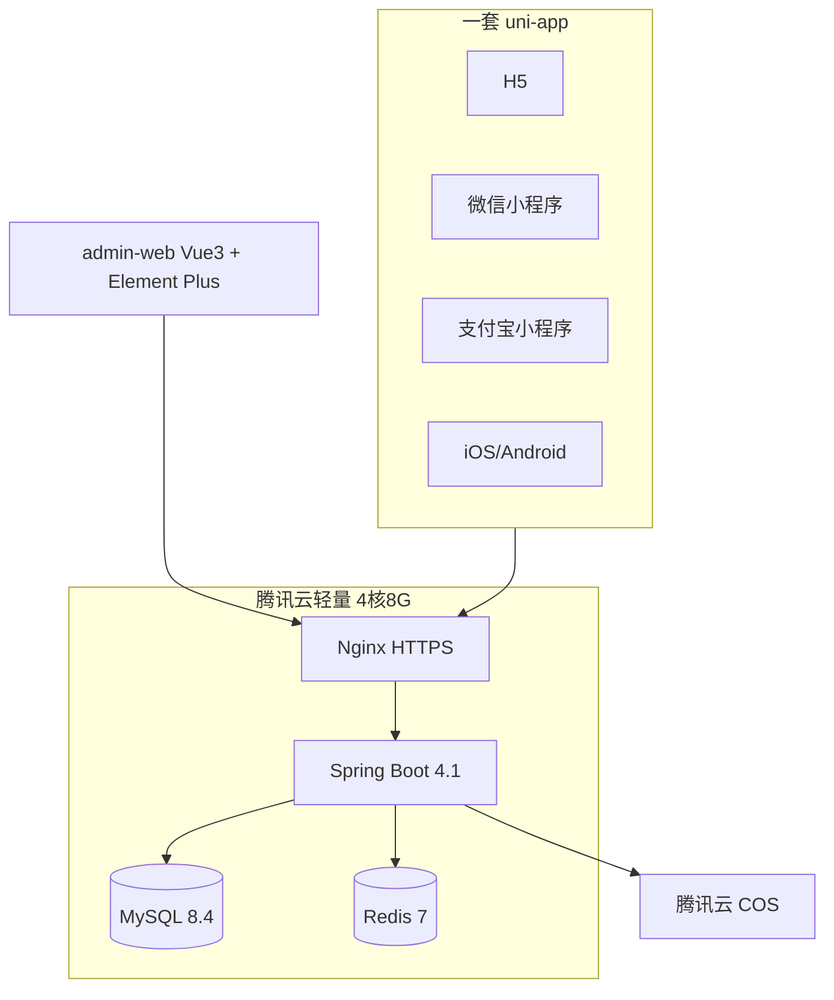

# 02 技术选型

> 与 README 定稿一致。版本号以 **2026 年 8 月**核实,落地时再核 Maven Central / npm 补丁版。
>
> 配套文档:`docs/06-接口设计.md`(后端契约)、`docs/07-前端工程落地.md`(目录/骨架/验收)。

## 一、总览

| 层 | 选型 | 说明 |
| --- | --- | --- |
| 多端应用 | uni-app 3.x(Vue3 + Vite + TypeScript + Pinia)+ wot-design-uni | 一套代码编译 H5 / 微信小程序 / 支付宝小程序 / iOS / Android |
| 管理后台 | Vue3 + Vite + TypeScript + Element Plus + Pinia | 动态菜单 + 按钮权限对接后端 RBAC |
| 后端 | Spring Boot 4.1.x + JDK 21 + MyBatis-Plus + Sa-Token + Knife4j | 单体分模块:admin-api / app-api / common |
| 存储 | MySQL 8.4 + Redis 7 | 图片走腾讯云 COS |
| 部署 | Docker Compose(mysql/redis/backend)+ 宿主机 Nginx | HTTPS:acme.sh;详见 `docs/04` |



---

## 二、后端版本与坐标

| 组件 | 坐标 / 名称 | 推荐版本 | 说明 |
|---|---|---|---|
| JDK | Eclipse Temurin | **21** LTS | 启用虚拟线程 `spring.threads.virtual.enabled=true` |
| Spring Boot | `org.springframework.boot:spring-boot-starter-parent` | **4.1.1** | 4.1 分支 2026-08 稳定版 |
| MyBatis-Plus | `com.baomidou:mybatis-plus-spring-boot4-starter` | **3.5.17** | 必须用 **boot4** starter |
| Sa-Token | `cn.dev33:sa-token-spring-boot4-starter` | **1.46.0** | 1.45.0 起适配 Boot 4 |
| Sa-Token Redis | `cn.dev33:sa-token-redis-template` | **1.46.0** | token 落 Redis |
| Knife4j | `com.baizhukui:knife4j-openapi3-boot4-spring-boot-starter` | **5.3.3** | 原 `com.github.xiaoymin` 不支持 Boot 4;入口仍 `/doc.html` |
| Lombok | `org.projectlombok:lombok` | **1.18.46** | JDK 21 需在 compiler plugin 配 `annotationProcessorPaths` |
| Hutool | `cn.hutool:hutool-all` | **5.8.47** | 可按需改为 hutool-core |
| COS SDK | `com.qcloud:cos_api` | **5.6.273** | 配合 `cos-sts_api` 下发临时密钥 |
| MySQL 驱动 | `com.mysql:mysql-connector-j` | Boot BOM(9.x) | 服务端 MySQL **8.4 LTS** |
| Redis | Redis Server | **7.x** | token、验证码、缓存、抢单锁 |
| Maven | 3.9.x | `maven-compiler-plugin` ≥ 3.13 | |

关键 POM:

```xml
<properties>
  <java.version>21</java.version>
  <mybatis-plus.version>3.5.17</mybatis-plus.version>
  <sa-token.version>1.46.0</sa-token.version>
  <knife4j.version>5.3.3</knife4j.version>
  <lombok.version>1.18.46</lombok.version>
  <hutool.version>5.8.47</hutool.version>
  <cos.version>5.6.273</cos.version>
</properties>
```

---

## 三、Maven 多模块

单体单进程。三个模块:`recycle-common`、`recycle-app-api`、`recycle-admin-api`(兼启动模块)。基础包名 `com.recycle`。

```text
backend/                          # 聚合父 POM
├── pom.xml
├── recycle-common/               # 实体/Mapper/R/错误码/Sa-Token/AOP/COS
├── recycle-app-api/              # /app-api/**  C端+B端
└── recycle-admin-api/            # /admin-api/** + RecycleApplication
    └── src/main/resources/
        ├── application.yml
        ├── application-local.yml.example
        └── application-prod.yml
```

完整包树、依赖关系、统一响应 `R<T>`、错误码、Sa-Token 三套 loginType、配置项、异常/AOP 约定见 `docs/06-接口设计.md` 的「实现约定」章,以及下文摘要。

依赖方向:

```text
recycle-admin-api ──depends──> recycle-app-api ──depends──> recycle-common
```

约定:

- Controller 只做入参校验与 `R` 包装;业务在 Service;Mapper 不进 Controller。
- `common` 禁止 `@RestController`;admin 编码禁止 import `com.recycle.app.*`(聚合依赖仅为打唯一 fat-jar)。
- 雪花 ID JSON 序列化为字符串;金额 `BigDecimal` 序列化为字符串;重量 kg、`DECIMAL(10,3)` 或两位小数按 `docs/01` 计价规则(行小计 round 2 位)。

### 3.1 Sa-Token 多账号

| loginType | 表 | 用途 |
| --- | --- | --- |
| `admin` | `sys_admin` | 管理后台 |
| `user` | `user` | C 端客户 |
| `boss` | 同一 `user` 表 | B 端老板,登录端隔离 |

同一手机号可同时持有 C/B 两个互不影响的 token;B 端登录必须 `role=recycler`(或 identity 含 BOSS)。请求头 `Authorization` 直接传 token 值,**不加 Bearer**(与 Sa-Token `token-prefix: ""` 一致)。前端封装必须与此对齐。

拦截:

- `/admin-api/**` 除登录外 `StpKit.ADMIN.checkLogin()`
- `/app-api/boss/**` `StpKit.BOSS.checkLogin()`
- 其余 `/app-api/**` 除公开接口外 `StpKit.USER.checkLogin()`

Knife4j 分组:`admin-api` / `app-api`;生产关闭文档。

### 3.2 骨架 vs 完整业务

| 域 | 本阶段骨架(README) | 完整业务(按 docs/01 P0) |
| --- | --- | --- |
| 工程 | 三模块、R/分页/错误码、全局异常、Knife4j 双分组 | 补充分层约束 |
| 管理端登录 | 账密 + 菜单树 | 图形验证码、失败锁定 |
| RBAC | admin/role/menu CRUD + `@SaCheckPermission` | 数据权限(按门店) |
| 分类/SKU | 分类树 + SKU CRUD + 单个改价 | 批量改价、生效时间、调价记录 |
| App 登录 | 手机号+验证码(mock)、微信/支付宝占位 | 真实 code2session |
| App 业务 | 查价只读 | 地址/下单/接单/称重/完成 |
| 文件 | COS 签名可 mock | STS 正式签发 |

骨架验收:`/doc.html` 两组可调试;管理端登录 → 按角色看菜单 → 分类/SKU CRUD 留操作日志;App 端手机号登录并查价。

---

## 四、前端版本

### 4.1 admin-web

| 依赖 | 版本 |
| --- | --- |
| vue | ^3.5 |
| vite | ^5.4 |
| vue-router | ^4.5 |
| pinia | ^3.0 |
| element-plus | ^2.14 |
| axios | ^1.11 |
| sass | ^1.79 |
| typescript | ~5.5 |

初始化:`pnpm create vite admin-web --template vue-ts`

### 4.2 app-uni

| 依赖 | 版本 | 说明 |
| --- | --- | --- |
| `@dcloudio/*` | 5.x,用 `npx @dcloudio/uvm@latest` 对齐 | **全家桶必须同版本**,禁止单独升包 |
| vue / vite | 跟随 uni 模板锁定 | 不要与 admin-web 对齐升级 |
| pinia | ^2.3 | 小程序端对 pinia 3.x 未完全验证 |
| wot-design-uni | ^1.14.0 | npm + easycom |
| sass | ~1.77 | 避开新版 sass 与 uni 编译器冲突 |
| typescript | ~5.4 | |

初始化:

```bash
npx degit dcloudio/uni-preset-vue#vite-ts app-uni
cd app-uni && npx @dcloudio/uvm@latest
pnpm add wot-design-uni pinia@^2.3 && pnpm add -D sass@~1.77
```

### 4.3 双角色 tabBar(定稿)

原生 `tabBar` 编译期静态、最多 5 项、运行时不能整套替换;`custom-tab-bar` 仅微信支持。

**定稿**:每个角色一个壳页 + 组件化 tab + `wd-tabbar`;登录后 `reLaunch` 到对应壳页。支付宝/H5/App 行为一致。长列表用 `scroll-view` 自管刷新;必要时单个 tab 降级为独立页面。

---

## 五、跨文档对齐约定(落地必须遵守)

并行起草时出现过路径/状态差异,以下为**唯一口径**,与 `docs/01` 冲突时以 01 为准:

| 项 | 口径 |
| --- | --- |
| API 前缀 | 管理端 `/admin-api`,App `/app-api` |
| Token | 请求头 `Authorization: {token}`,无 Bearer |
| 订单状态 | `PENDING → ACCEPTED → SERVING → WEIGHED → COMPLETED / CANCELLED`(见 docs/01) |
| 结算 | 线下当面付款,老板标记完成;**不做用户确认称重、不做在线支付** |
| 角色切换 | P0:`recycler` 不能切回客户下单(docs/01 §11);未审核老板走入驻/审核页拦截 |
| 图片上传 | 优先 COS STS 直传;骨架可 mock 签名,契约见 docs/06 |
| H5 部署 | 独立子域根路径 `h5.example.com`,与 `docs/04` Nginx 一致 |

---

## 六、本地与生产配置要点

本地:`deploy/docker-compose.local.yml` 起 MySQL 8.4 + Redis 7;后端 `spring.profiles.active=local`。

`application.yml` 公共项:端口 8080、虚拟线程、Jackson GMT+8、MP 逻辑删除 `deleted`、雪花 ID、Sa-Token、Knife4j。

`application-local.yml`(gitignore):数据源、Redis、COS 密钥、微信/支付宝占位、`app.sms.mock=true`(验证码固定 123456)。

生产:环境变量注入,CORS 仅 `https://h5.example.com` 与 `https://admin.example.com`;Nginx 屏蔽 `/doc.html` 与 `/actuator`。
