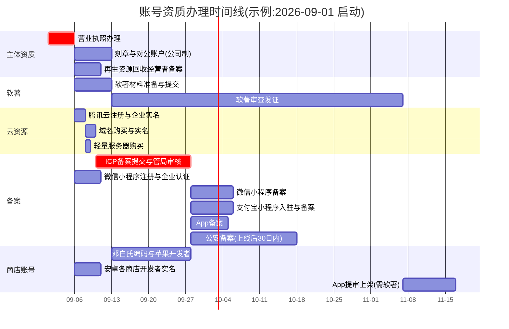

# 03 账号资质与备案办理指引

> 适用主体:垃圾回收平台(uni-app 多端 + 管理后台 + Spring Boot 后端)。
> 结论先行:**营业执照是一切经营类资质的前置依赖,今天就启动;软著周期最长(约 2 个月),拿到执照后立即提交;ICP 备案在买完域名和服务器后立即提交,备案期间不影响开发。**
> 本平台不做线上钱包/提现,资金线下当面结算,因此**不需要**支付牌照、微信支付商户号、企业付款到零钱等资质(未来若做再评估)。

## 一、办理事项总清单(按办理时长从长到短排序)

> 表内"操作步骤"为浓缩版,逐步可执行的详细步骤见第二节对应小节。周期均为常见实际耗时,含审核等待。

| # | 事项 | 主体要求 | 费用 | 周期 | 官网入口 | 操作步骤(浓缩) | 依赖关系 | 卡点 |
|---|------|----------|------|------|----------|------------------|----------|------|
| 1 | 软件著作权(App/小程序上架安卓商店必需) | 企业或个体户(个人也可,但建议与执照主体一致) | 自办 0 元;代办约 300-800 元 | 自办约 55-65 天;加急代办 1-2 周(数百至上千元) | [中国版权保护中心](https://register.ccopyright.com.cn) | ①注册账号并实名 ②在线填报软件信息 ③上传源代码前后各 30 页 + 说明文档 ④邮寄/在线提交签章申请表 ⑤等待受理与发证 | 依赖营业执照(以企业名义申请) | 材料格式不合规会被补正,一次补正多等 2-4 周;源代码需去除第三方版权头 |
| 2 | 苹果开发者账号(公司版) | 公司(个体户不可开公司版;个人版上架主体与执照不一致有下架风险) | $99/年(约 700 元) | 邓白氏编码 1-2 周 + 苹果审核 2-5 天 | [developer.apple.com](https://developer.apple.com/cn/programs/enroll/) | ①免费申请邓白氏 D-U-N-S 编码 ②Apple ID 开双重认证 ③以公司身份注册开发者计划 ④付年费 ⑤等电话回访核实 | 依赖营业执照(公司制) | 个体户办不了公司版;邓白氏信息与执照不一致会反复退回 |
| 3 | ICP 备案(网站/域名备案) | 企业或个体户(个人主体不能备"经营类"用途) | 0 元 | 腾讯云初审 1-2 个工作日 + 管局 3-22 个工作日,常见 1-2 周 | [腾讯云备案控制台](https://console.cloud.tencent.com/beian) | ①域名实名与云账号主体一致 ②备案控制台新增备案 ③填主体+网站信息、上传执照/法人证件 ④法定代表人小程序人脸核验 ⑤等管局短信 | 依赖:营业执照、已实名域名、包年≥3 个月的腾讯云服务器 | 网站名称不能含敏感词且要与经营范围相关;备案期间该域名不能解析到境内服务器对外开放 80/443 |
| 4 | 公安备案(网络安全备案) | 与 ICP 备案同主体 | 0 元 | 网站开通后 30 日内提交,审核 1-4 周 | [全国互联网安全管理服务平台](https://beian.mps.gov.cn) | ①注册并实名 ②新办网站备案 ③填网站信息(域名、ICP 备案号、服务器所在地) ④部分地区需到属地网安大队现场核验 ⑤获发公安备案号并挂到网站底部 | 依赖 ICP 备案通过、网站已上线 | 属地公安要求不一,可能要求现场面签;逾期未备可能被约谈 |
| 5 | 营业执照(个体户或有限公司) | 自然人发起 | 0 元(政府不收费);地址挂靠/代办另计 300-1500 元/年 | 个体户 1-3 个工作日;公司 3-7 个工作日(+刻章、银行开户 1 周) | 各省政务网 / 当地"一网通办" | ①想好字号(准备 3 个备选) ②经营范围勾选"再生资源回收(除生产性废旧金属)、互联网信息服务" ③线上核名提交 ④电子签名 ⑤领电子/纸质执照 ⑥公司制需刻章+对公账户 | 无前置依赖,**关键路径起点** | 经营范围漏写"再生资源回收"后面备案会卡;住宅地址部分地区不给注册,需挂靠 |
| 6 | 微信小程序注册 + 企业认证 + 小程序备案 | 企业或个体户(**个人主体不能上线经营类小程序**) | 认证 300 元/年 | 注册当天 + 认证 1-5 个工作日 + 小程序备案 1-10 个工作日 | [mp.weixin.qq.com](https://mp.weixin.qq.com) | ①新邮箱注册小程序 ②主体选企业,对公打款或法人扫脸验证 ③交 300 元认证费 ④完成微信侧小程序备案 ⑤配置服务类目"生活服务>废品回收" | 依赖营业执照;上线依赖 ICP 备案(request 域名需已备案) | 类目需要与执照经营范围匹配;未备案小程序无法发布新版本 |
| 7 | App 备案(与 ICP 同平台) | 与 ICP 备案同主体 | 0 元 | 3-10 个工作日 | [腾讯云备案控制台](https://console.cloud.tencent.com/beian) | ①在已有 ICP 主体下"新增 App" ②填 App 名称、包名、公钥、签名 MD5 ③安卓/iOS 平台信息分别填 ④等管局审核 | 依赖 ICP 主体备案通过、安卓签名证书已生成 | 包名和签名一旦备案,后续改签名要变更备案 |
| 8 | 支付宝小程序 + 企业认证 + 备案 | 企业或个体户 | 0 元(企业认证免费) | 认证 1-3 个工作日 + 备案 1-10 个工作日 | [open.alipay.com](https://open.alipay.com) | ①企业支付宝账号注册(对公户验证) ②开放平台入驻,创建小程序 ③完成支付宝侧小程序备案 ④配置类目与服务器域名白名单 | 依赖营业执照、对公账户;上线依赖 ICP 备案 | 企业支付宝账号需要对公银行账户 |
| 9 | 安卓应用商店开发者账号(华为/小米/OPPO/vivo/应用宝) | 企业(个体户部分商店可以) | 均免费 | 每家实名审核 1-3 个工作日 | 华为 AGC / 小米开放平台 / OPPO 开放平台 / vivo 开放平台 / 应用宝 | ①逐家注册企业开发者 ②上传执照+法人证件实名 ③创建应用填包名 ④提审时上传软著+ICP/App 备案号 | 上架依赖:软著、App 备案、公安备案(部分商店) | 每家商店要求略有差异;无软著基本无法过审 |
| 10 | 域名购买 + 实名 | 与后续备案主体一致(务必用企业名义实名) | .com 约 55-75 元/年 | 购买即时,实名审核数小时-1 天 | [腾讯云域名注册](https://buy.cloud.tencent.com/domain) | ①搜索并购买域名 ②创建"企业"信息模板并实名 ③域名绑定该模板 ④暂不解析(等备案) | 依赖腾讯云账号;是 ICP 备案前置 | 实名主体若填个人,备案时要先做主体变更 |
| 11 | 腾讯云账号 + 企业实名 + 轻量服务器 | 企业实名(个人实名也能买,但备案主体必须为企业) | 服务器 4核8G:新用户约 450-880 元/年 | 当天完成 | [腾讯云](https://cloud.tencent.com) | ①注册账号 ②企业实名 ③购买轻量应用服务器 4核8G、上海/广州、Ubuntu 22.04/24.04、**包年** ④重置 root 密码/绑密钥 | 依赖营业执照(企业实名) | 按量计费/时长不足 3 个月的服务器不能用于备案 |

## 二、逐项详细操作步骤

### 2.1 营业执照(关键路径,第 0 天启动)

推荐**个体工商户**起步(注册快、报税简、无对公户也可运营;缺点:办不了苹果公司开发者账号)。若确定要上 App Store,直接注册**有限公司**。

1. 准备:法人身份证、手机号、经营地址证明(房产证/租赁合同;住宅需居委会/物业同意证明,视地区)。
2. 打开所在省政务服务网(搜"XX省 企业开办 一网通办"),选择"个体工商户设立登记"或"企业设立登记"。
3. 核名:准备 3 个字号备选,如"XX再生资源回收服务部/有限公司"。
4. 经营范围务必包含:**再生资源回收(除生产性废旧金属)**;再加上"互联网销售、信息技术服务、软件开发"。若要回收废铜废铁等生产性废旧金属,范围写"生产性废旧金属回收",并在领照后到属地公安机关备案。
5. 在线提交 → 法人电子签名(政务 App 扫脸)→ 1-7 个工作日领电子执照,可同时申领纸质。
6. 公司制额外做:刻章(公章/财务章/法人章,多地政府免费)、银行对公账户(预约 1 周内)、税务登记与社保开户。
7. 领照后 30 日内完成"再生资源回收经营者备案"(见第三节)。

### 2.2 软件著作权(周期最长,领照后立即提交)

1. 注册 [中国版权保护中心](https://register.ccopyright.com.cn) 账号,以企业名义实名。
2. 准备材料:
   - 源代码文档:前 30 页 + 后 30 页,每页 50 行,PDF,页眉写软件全称+版本号;不足 60 页全交;删除第三方开源版权头。
   - 说明文档:操作手册(带界面截图,建议 10-20 页)。
   - 软件全称示例:"XX垃圾回收平台系统 V1.0"(App、小程序、后台可以合并为一个软著,也可拆成 2-3 个分别登记,商店上架一个即够)。
3. 在线填报 R11 表(开发方式选"独立开发",权利取得方式"原始取得")。
4. 打印申请表,盖公章,按页面指引邮寄或线上提交(多数省已全程网办)。
5. 受理后约 30-40 个工作日发证;补正会显著拉长周期,填报时严格按模板。
6. 不想等可找代办加急(1-2 周,几百到一千多元),证书效力相同。

### 2.3 腾讯云账号、域名、服务器(第 1 周内完成)

1. 注册腾讯云 → 账号中心 → 企业实名认证(对公打款验证或法人微信扫脸)。
2. 购买域名:控制台 → 域名注册 → 搜索规划域名 → 购买 1-3 年。文中以 `example.com` 代指。
3. 域名信息模板:创建"企业"类型模板,填执照名称与统一社会信用代码,提交实名(数小时-1 天)。
4. 购买轻量应用服务器:地域选广州/上海,镜像 Ubuntu 24.04,套餐 4核8G,**包年**。记下公网 IP。
5. 先不解析域名到服务器(备案通过前解析并开放 80/443 会被阻断),开发期用 IP + 端口自测。

### 2.4 ICP 备案(买齐域名+服务器后立即提交)

1. 进入 [腾讯云备案控制台](https://console.cloud.tencent.com/beian) → 开始备案 → 首次备案。
2. 验证备案资源:选择轻量服务器(剩余时长需≥3 个月)。
3. 主体信息:企业名称、信用代码、法人身份证正反面、执照照片;通讯地址精确到门牌。
4. 网站信息:
   - 网站名称:建议"XX再生资源回收服务平台"(3 个字以上,不用纯地名/人名,不带"中国""国家"字样)。
   - 服务内容:选"综合门户/生活服务"类;域名填 `example.com`。
   - 备注栏写明:"本网站为再生资源回收信息服务平台,提供上门回收预约与回收站信息展示,不涉及在线支付结算。"——能显著减少管局打回。
5. 法定代表人用"腾讯云网站备案"小程序做人脸核验并短信确认。
6. 腾讯云初审(1-2 个工作日,会电话核实)→ 提交管局(3-22 个工作日)→ 通过后短信下发备案号。
7. 通过后 24 小时内:把备案号 + 工信部链接(beian.miit.gov.cn)放到 H5 与管理后台页脚。

### 2.5 微信小程序:注册、企业认证、小程序备案

1. 用一个未绑定过公众平台的邮箱在 [mp.weixin.qq.com](https://mp.weixin.qq.com) 注册"小程序"。
2. 主体类型选"企业",填执照信息;验证方式二选一:对公账户向腾讯打款(1-2 天)或法人微信扫脸(即时)。
3. 完成微信认证:交 300 元/年,1-5 个工作日电话核实。**个人主体无法选经营类类目,这就是必须有执照的原因。**
4. 小程序备案(微信公众平台内"小程序备案"入口):填主体+小程序信息,法人核验,提交管局,1-10 个工作日。**未备案的小程序无法上架发布。**
5. 设置 → 基本设置 → 服务类目:选"生活服务 > 废品回收"(需上传营业执照,若类目要求提供"再生资源回收经营者备案登记证明"则上传第三节的备案回执)。
6. 开发管理 → 开发设置:记下 AppID/AppSecret;request 合法域名填 `https://api.example.com`(必须已 ICP 备案 + HTTPS)。

### 2.6 支付宝小程序

1. 注册企业支付宝账号(需对公账户;个体户可用法人银行卡+执照认证)。
2. 登录 [open.alipay.com](https://open.alipay.com) → 入驻为"企业开发者"(免费)。
3. 控制台创建小程序,填名称/简介/类目("本地生活 > 废品回收/家政服务"就近选择)。
4. 完成支付宝侧小程序备案(平台内入口,材料同微信侧)。
5. 开发设置:配置服务器域名白名单 `https://api.example.com`;记下 AppID,生成应用公私钥(uni-app 登录用)。

### 2.7 App 备案 + 公安备案

App 备案(上架安卓商店与 App Store 中国区前必须完成):

1. 先用 HBuilderX 生成安卓签名证书(或云端证书),得到包名、证书公钥、签名 MD5。
2. 腾讯云备案控制台 → 在已通过的 ICP 主体下"新增 App"。
3. 填 App 名称(与商店上架名一致)、包名、平台(Android/iOS 各填一条)、公钥、MD5。
4. 管局审核 3-10 个工作日,通过后获得 App 备案号,上架时填入各商店。

公安备案(网站开通后 30 日内):

1. 注册 [beian.mps.gov.cn](https://beian.mps.gov.cn),法人实名。
2. "新办网站申请":填 ICP 备案号、域名、服务器服务商(腾讯云)与所在地、网站类型(交互式:有用户发布内容/下单,选"是")。
3. 属地网安审核,部分地区通知到大队现场核验(带执照与法人身份证)。
4. 通过后把公安备案号 + 图标挂到网站页脚(与 ICP 备案号并列)。

### 2.8 苹果与安卓商店开发者账号

苹果(仅公司制可办公司版):

1. 到 [邓白氏免费申请页](https://developer.apple.com/enroll/duns-lookup/) 提交公司信息,拿 D-U-N-S 编码(1-2 周,免费,勿走收费代办)。
2. 法人或授权员工的 Apple ID 开启双重认证。
3. developer.apple.com → Enroll → 主体选 Company/Organization,填邓白氏编码。
4. 支付 $99/年,等待苹果电话回访,确认公司信息。
5. 通过后在 App Store Connect 创建 App,Bundle ID 与 App 备案一致。

安卓五大商店(华为 AGC、小米、OPPO、vivo、应用宝):逐家注册企业开发者(免费)→ 上传执照实名(1-3 天/家)→ 创建应用 → 提审时统一需要:APK/AAB、软著证书、ICP 备案号、App 备案号、隐私政策 URL、权限说明。建议先上华为 + 应用宝,其余陆续补。

## 三、再生资源回收经营者备案(平台与入驻回收站双侧合规)

依据《再生资源回收管理办法》(商务部令 2007 年第 8 号):从事再生资源回收经营活动,应当在取得营业执照后 **30 日内**,向登记注册地的县级商务主管部门(现多并入政务服务"一网通办",搜"再生资源回收经营者备案")办理备案;回收**生产性废旧金属**(废钢、电缆、机电设备件等)的,还应在取得执照后 15 日内向所在地县级公安机关备案。备案免费,材料一般为:营业执照、法人身份证、经营场所证明,线上提交 1-5 个工作日出回执。

对平台的两层含义:

1. **平台自身**:主体经营范围含"再生资源回收",领照后自己也要完成该备案。
2. **入驻回收站(B 端老板)**:入驻审核时应要求上传营业执照,并提示完成经营者备案;审核字段建议加"再生资源回收备案回执(选传)"。

平台提示文案建议(可直接用于入驻页/协议):

> **入驻资质提示**
>
> 根据《再生资源回收管理办法》,从事再生资源回收经营应当办理工商登记,并在取得营业执照后 30 日内向所在地县级商务主管部门办理"再生资源回收经营者备案";回收生产性废旧金属的,还须自取得执照之日起 15 日内向所在地公安机关备案。
>
> 请确保贵回收站已完成上述登记与备案。平台将对营业执照进行审核;未按规定备案产生的行政责任由经营者自行承担。如尚未备案,可前往当地政务服务网搜索"再生资源回收经营者备案"在线办理(免费)。

## 四、时间线(甘特图,以 9 月 1 日启动为例)

关键结论:**约第 3-4 周**具备"H5 + 微信小程序"上线条件(执照 + ICP + 微信侧备案齐);**约第 9-10 周**具备 App 商店上架条件(等软著)。开发工作与所有审批全程并行,互不阻塞。

## 五、首年费用明细

| 项目 | 金额(元) | 说明 |
|------|-----------:|------|
| 营业执照 | 0 | 政府不收费;地址挂靠另计 300-1500/年 |
| 再生资源回收经营者备案 | 0 | 政务网免费办理 |
| 域名 .com | 60 | 首年常见 55-75 元 |
| 腾讯云轻量 4核8G(包年) | 450-880 | 新用户促销价区间 |
| ICP 备案 / App 备案 / 公安备案 | 0 | 均免费 |
| 软件著作权(自办) | 0 | 代办 300-800,加急另计 |
| 微信小程序企业认证 | 300 | 每年一次 |
| 支付宝小程序企业入驻 | 0 | 免费 |
| 苹果开发者(公司版) | ≈700 | $99/年;个体户方案则为 0(不上 iOS) |
| 安卓五大商店开发者 | 0 | 均免费 |
| 腾讯云 COS + CDN 流量 | 50-150 | 初期图片量小 |
| 短信验证码(可选) | 0-100 | 腾讯云短信包 |
| HTTPS 证书 | 0 | acme.sh 免费签发 |
| **合计** | **约 1560-2190** | 公司制含苹果;个体户不上 iOS 约 860-1490 |

与 README 估算 2000-2800 元的差异:本表按 2026 年常见促销价;若含地址挂靠、软著代办、短信超量,可回到 README 区间。
