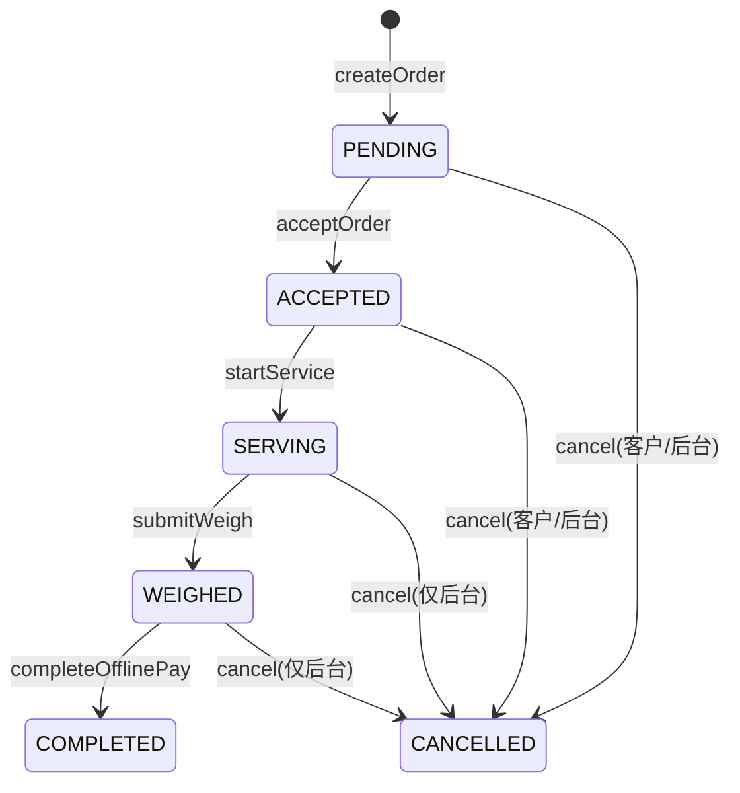

# 06 接口设计

> 实现约定与版本见 `docs/02-技术选型.md`。状态机、计价、权限以 `docs/01-需求调研.md` 为准。
>
> Base URL:`https://api.example.com`(本地 `http://localhost:8080`)
> 前缀:管理端 `/admin-api`,App `/app-api`
> 鉴权:请求头 `Authorization: {token}`(Sa-Token,无 Bearer)
> 响应一律 `R<T>`:`{ code, msg, data, ts }`,`code=0` 成功
> 分页:`pageNum`(默认 1)、`pageSize`(默认 10,上限 100);响应 `{ total, pages, list }`
> ID 雪花长整型,JSON 中为字符串;金额单位元(字符串);重量 kg。

## 1. 统一响应、错误码、鉴权

成功:

```json
{ "code": 0, "msg": "ok", "data": { "id": "1" }, "ts": 1787174400000 }
```

失败:

```json
{ "code": 20402, "msg": "订单当前状态不允许该操作", "data": null, "ts": 1787174400000 }
```

错误码分段:`0` 成功;`4xxxx` 鉴权/参数;`5xxxx` 服务端;`1xxxx` 用户;`2xxxx` 订单;`3xxxx` 商品价格;`6xxxx` 门店;`7xxxx` 文件。

| 码 | 含义 |
| --- | --- |
| 40000 | 请求参数错误 |
| 40100 | 未登录或登录已过期 |
| 40101 | 账号已在其他设备登录 |
| 40300 | 无权限 |
| 40400 | 资源不存在 |
| 42900 | 请求过于频繁 |
| 50000 | 系统繁忙 |
| 10001–10005 | 用户不存在 / 禁用 / 验证码错误 / 账密错误 / 非老板身份 |
| 20401–20403 | 订单不存在 / 状态非法 / 已被抢 |
| 30001–30002 | 分类下有子级或 SKU / SKU 已下架 |
| 60001–60002 | 重复入驻申请 / 门店未审核 |
| 70001–70002 | 文件类型不允许 / 签名失败 |

三套 loginType:`admin`(sys_admin)、`user`(C 端)、`boss`(B 端,同一 user 表隔离)。管理端细粒度 `@SaCheckPermission`。公开接口见各表「权限」列。

Knife4j:`/doc.html` 两组 `admin-api` / `app-api`;生产关闭。

全局异常:`BizException` → `R.fail`;校验失败 → 40000;Sa-Token 未登录 → 40100;无权限 → 40300;其余 → 50000 且不泄漏堆栈。

操作日志:`@OpLog` + AOP 异步写 `sys_log`,脱敏 password/token/secret。

---

## 2. 订单状态机(与 docs/01 一致)



| 状态 | 含义 | 触发接口 |
| --- | --- | --- |
| PENDING | 待接单 | `POST /app-api/order` |
| ACCEPTED | 已接单 | `POST /app-api/boss/order/{id}/accept` |
| SERVING | 服务中 | `POST /app-api/boss/order/{id}/start` |
| WEIGHED | 已称重,金额锁定 | `POST /app-api/boss/order/{id}/weigh` |
| COMPLETED | 线下已付款完成 | `POST /app-api/boss/order/{id}/complete` |
| CANCELLED | 已取消 | 客户:仅 PENDING/ACCEPTED;后台:非终态 |

抢单:`UPDATE recycle_order SET status='ACCEPTED', station_id=? WHERE id=? AND status='PENDING'`,影响行数 0 → 20403。称重单价取提交时刻生效价快照。P0 **不做**用户确认称重、**不做**在线支付。

---

## 3. 管理端 API

### 3.1 认证与菜单

| 方法 | 路径 | 权限 | 说明 |
|---|---|---|---|
| POST | `/admin-api/auth/login` | 公开 | 账密登录 |
| POST | `/admin-api/auth/logout` | 登录(admin) | 登出 |
| GET | `/admin-api/auth/me` | 登录(admin) | 当前管理员 + perms |
| GET | `/admin-api/auth/menus` | 登录(admin) | 动态路由菜单树 |
| GET | `/admin-api/auth/captcha` | 公开 | 图形验证码(P1;骨架可省略) |

登录请求/响应:

```json
{ "username": "admin", "password": "Admin@123" }
```

```json
{
  "code": 0, "msg": "ok",
  "data": {
    "token": "3x9k...64位",
    "admin": { "id": "1", "username": "admin", "nickname": "超级管理员", "avatar": "" },
    "roles": ["super_admin"],
    "perms": ["recycle:category:add", "recycle:sku:update"]
  }
}
```

菜单节点:`id/name/type(DIR|MENU|BUTTON)/path/component/icon/sort/perms/children`。

### 3.2 RBAC

| 方法 | 路径 | 权限 |
|---|---|---|
| GET/POST | `/admin-api/system/admin/page`、`/admin-api/system/admin` | `system:admin:list` / `add` |
| PUT | `/admin-api/system/admin/{id}` | `system:admin:update` |
| PUT | `/admin-api/system/admin/{id}/status` | `system:admin:update` |
| PUT | `/admin-api/system/admin/{id}/password` | `system:admin:resetPwd` |
| DELETE | `/admin-api/system/admin/{id}` | `system:admin:delete` |
| GET/POST/PUT/DELETE | `/admin-api/system/role` 及 `/{id}` | `system:role:*` |
| GET/PUT | `/admin-api/system/role/{id}/menus` | `system:role:list` / `assign` |
| GET | `/admin-api/system/menu/tree` | `system:menu:list` |
| POST/PUT/DELETE | `/admin-api/system/menu`、`/{id}` | `system:menu:add/update/delete` |

新增管理员:

```json
{ "username": "op001", "nickname": "运营小王", "password": "Init@123", "phone": "13800000001", "roleIds": ["2"], "status": 1 }
```

### 3.3 分类 / SKU / 价格

| 方法 | 路径 | 权限 |
|---|---|---|
| GET | `/admin-api/recycle/category/tree` | `recycle:category:list` |
| POST/PUT/DELETE | `/admin-api/recycle/category`、`/{id}` | add/update/delete |
| PUT | `/admin-api/recycle/category/{id}/status` | update |
| GET | `/admin-api/recycle/sku/page`、`/{id}` | `recycle:sku:list` |
| POST/PUT/DELETE | `/admin-api/recycle/sku`、`/{id}` | add/update/delete |
| PUT | `/admin-api/recycle/sku/{id}/status` | update |
| PUT | `/admin-api/recycle/sku/{id}/price` | `recycle:sku:price` |
| PUT | `/admin-api/recycle/sku/price/batch` | `recycle:sku:price` |
| GET | `/admin-api/recycle/sku/{id}/price-log` | list |

新增分类:

```json
{ "parentId": "0", "name": "废纸类", "icon": "https://cos.example.com/icon/paper.png", "sort": 1, "status": 1 }
```

新增 SKU:

```json
{
  "categoryId": "101",
  "name": "黄板纸（干净无胶带）",
  "image": "https://cos.example.com/sku/hbz.png",
  "unit": "kg",
  "price": "0.85",
  "sort": 1,
  "status": 1
}
```

改价(写 `sku_price` + `sku_price_log`;P0 生效时间可立即,P1 支持预约):

```json
{ "price": "0.92", "effectiveAt": "2026-08-29 00:00:00", "reason": "纸价上调" }
```

有子级或 SKU 时删除分类返回 30001。

### 3.4 回收站审核与门店

| 方法 | 路径 | 权限 |
|---|---|---|
| GET | `/admin-api/store/apply/page`、`/{id}` | `store:apply:list` |
| POST | `/admin-api/store/apply/{id}/audit` | `store:apply:audit` |
| GET | `/admin-api/store/page` | `store:store:list` |
| PUT | `/admin-api/store/{id}`、`/{id}/status` | `store:store:update` |

审核:

```json
{ "pass": true, "remark": "证照齐全" }
```

通过后:创建 `recycle_station`,用户 `role` 升为 `recycler`。

### 3.5 用户 / 订单 / 内容 / 日志 / 看板

| 方法 | 路径 | 权限 |
|---|---|---|
| GET | `/admin-api/member/user/page`、`/{id}` | `member:user:list` |
| PUT | `/admin-api/member/user/{id}/status` | `member:user:update` |
| GET | `/admin-api/trade/order/page`、`/{id}` | `trade:order:list` |
| POST | `/admin-api/trade/order/{id}/cancel` | `trade:order:cancel` |
| PUT | `/admin-api/trade/order/{id}/items` | 称重修正(P1,仅 WEIGHED) |
| CRUD | `/admin-api/content/banner` | `content:banner:*` |
| CRUD | `/admin-api/content/notice` | `content:notice:*` |
| GET | `/admin-api/system/oplog/page`、`/{id}` | `system:oplog:list` |
| GET | `/admin-api/dashboard/summary`、`/trend`、`/category-rank` | `dashboard:view` |

订单详情含:预估明细、实收明细、照片、地址快照、状态时间线。手机号列表脱敏。

看板 summary 示例:

```json
{
  "todayOrderCount": 86,
  "todayWeightKg": "1520.500",
  "todayAmount": "3210.50",
  "totalUserCount": 12000,
  "totalStoreCount": 45,
  "pendingApplyCount": 3
}
```

---

## 4. App 端 API

### 4.1 认证

| 方法 | 路径 | 权限 | 说明 |
|---|---|---|---|
| POST | `/app-api/auth/wx-login` | 公开 | 微信 code,骨架 mock openid |
| POST | `/app-api/auth/alipay-login` | 公开 | 支付宝占位 |
| POST | `/app-api/auth/sms-code` | 公开 | 60s 限频,骨架固定 123456 |
| POST | `/app-api/auth/phone-login` | 公开 | `{ phone, smsCode, client: "user"\|"boss" }` |
| POST | `/app-api/auth/bind-phone` | 登录 | 三方登录后绑手机 |
| POST | `/app-api/auth/logout` | 登录 | 登出当前端 |
| GET | `/app-api/user/me` | 登录(user/boss) | 资料 |
| PUT | `/app-api/user/profile` | 登录 | 昵称/头像 |

微信登录响应:

```json
{ "token": "9f2c...", "userId": "50001", "isNewUser": false, "hasPhone": true, "role": "customer" }
```

B 端 `client:"boss"` 且非 recycler → 10005。P0 不提供切回客户接口。

### 4.2 地址 / 首页 / 查价 / 附近门店

| 方法 | 路径 | 权限 |
|---|---|---|
| GET/POST/PUT/DELETE | `/app-api/user/address/list`、`/address`、`/{id}`、`/{id}/default` | 登录(user) |
| GET | `/app-api/home` | 公开 |
| GET | `/app-api/recycle/category/tree` | 公开 |
| GET | `/app-api/recycle/sku/list?categoryId=` | 公开 |
| GET | `/app-api/recycle/sku/search?keyword=` | 公开 |
| GET | `/app-api/timeslots` | 登录 | 可预约时段枚举 |
| GET | `/app-api/store/nearby?longitude=&latitude=` | 公开 |
| GET | `/app-api/store/{id}` | 公开 |
| GET | `/app-api/notices`、`/notices/{id}` | 公开 |

地址:

```json
{
  "receiver": "张三", "phone": "13800000001",
  "province": "广东省", "city": "深圳市", "district": "南山区",
  "street": "幸福路", "detail": "3栋2单元501",
  "longitude": 113.953411, "latitude": 22.537001,
  "isDefault": true
}
```

首页:`banners`、`hotCategories`、`notices`(最多 3 条)。查价 SKU 含今日生效价;无价显示暂无报价。

### 4.3 客户下单

| 方法 | 路径 | 权限 |
|---|---|---|
| POST | `/app-api/order` | 登录(user) |
| GET | `/app-api/order/page` | 登录(user) |
| GET | `/app-api/order/{id}` | 登录(user) |
| POST | `/app-api/order/{id}/cancel` | 登录(user) |
| GET | `/app-api/order/cancel-reasons` | 登录 |
| POST | `/app-api/store/apply` | 登录(user) |
| GET | `/app-api/store/apply/latest` | 登录(user) |

下单(上门):

```json
{
  "type": "PICKUP",
  "addressId": "60001",
  "appointDate": "2026-08-29",
  "appointPeriod": "09:00-11:00",
  "estimateItems": [{ "skuId": "1001", "estimateWeight": "10" }],
  "images": ["https://cdn.example.com/order/pic1.jpg"],
  "remark": "纸箱较多",
  "requestId": "客户端幂等键"
}
```

到店单带 `storeId`,类型 `DROPOFF`。进行中订单上限 5。取消仅 PENDING/ACCEPTED,必填原因。

### 4.4 老板端

| 方法 | 路径 | 权限 |
|---|---|---|
| GET | `/app-api/boss/workbench` | 登录(boss) |
| PUT | `/app-api/boss/store/business-status` | 登录(boss) |
| GET | `/app-api/boss/order/pool` | 登录(boss) |
| GET | `/app-api/boss/order/page` | 登录(boss) |
| GET | `/app-api/boss/order/{id}` | 登录(boss) |
| POST | `/app-api/boss/order/{id}/accept` | 登录(boss) |
| POST | `/app-api/boss/order/{id}/start` | 登录(boss) |
| GET | `/app-api/boss/order/{id}/weigh-init` | 登录(boss) |
| GET | `/app-api/boss/skus/available` | 登录(boss) |
| POST | `/app-api/boss/order/{id}/weigh` | 登录(boss) |
| POST | `/app-api/boss/order/{id}/complete` | 登录(boss) |
| GET/PUT | `/app-api/boss/store` | 登录(boss) |

接单大厅仅返回半径内 PENDING 订单脱敏摘要。休息中/未审核接单拒绝。

称重:

```json
{
  "items": [
    { "skuId": "1001", "weight": "8.50" },
    { "skuId": "2001", "weight": "3.33" }
  ],
  "images": ["https://cdn.example.com/weigh/w1.jpg"],
  "remark": ""
}
```

行小计 `round(重量×当时生效价, 2)`,总额为行小计之和。完成:

```json
{ "confirmAmount": "18.37" }
```

金额必须与锁定总额一致。`payMethod` 固定线下,不接支付渠道。

---

## 5. COS 上传签名

| 方法 | 路径 | 权限 |
|---|---|---|
| POST | `/app-api/common/cos/upload-sign` | 登录(user/boss) |
| POST | `/admin-api/common/cos/upload-sign` | 登录(admin) |

请求:`{ "scene": "weigh", "ext": "jpg", "count": 2 }`,`scene` 白名单 `avatar/order/weigh/apply/banner/sku/icon/notice`。

响应含 bucket、region、服务端生成的 keys、STS credentials、过期时间、cdnHost。policy 仅 `PutObject` 且前缀锁定。`ext` 仅 jpg/jpeg/png/webp;`count`≤9。骨架可返回 mock,契约不变。

入库 URL 必须以本项目 cdnHost 开头。

---

## 6. Maven 包结构(落地对照)

```text
backend/
├── recycle-common/src/main/java/com/recycle/common/
│   ├── core/          # R、PageResult、PageQuery、ErrorCode、BizException
│   ├── entity/        # 全部 DO(base/system/member/recycle/trade/store/content)
│   ├── mapper/
│   ├── satoken/       # StpKit
│   ├── config/        # MP、Redis、Jackson
│   ├── exception/     # GlobalExceptionHandler
│   ├── log/           # @OpLog + Aspect
│   └── cos/
├── recycle-app-api/src/main/java/com/recycle/app/
│   ├── controller/{auth,user,home,recycle,order,boss,common}
│   ├── service/impl/
│   ├── dto/  vo/  config/
└── recycle-admin-api/src/main/java/com/recycle/
    ├── RecycleApplication.java
    └── admin/controller/{auth,system,recycle,store,member,trade,content,dashboard,common}
```

配置文件关键项见 `docs/02` §六。

---

## 7. 骨架阶段必须实现的接口

对应 README「登录 + RBAC + 分类/SKU 示例 CRUD」:

- 管理端:`/admin-api/auth/*`、`/admin-api/system/admin|role|menu` 全量、`/admin-api/recycle/category` 全量、`/admin-api/recycle/sku` 全量(含单个改价)、`/admin-api/system/oplog/page`、COS 签名(可 mock)
- App 端:`/app-api/auth/sms-code`、`phone-login`、`wx-login`(mock)、`/app-api/user/me`、`/app-api/recycle/category/tree`、`/app-api/recycle/sku/list`、COS 签名(可 mock)

其余接口按本文档契约在 P0 业务步实现,骨架阶段不要上假接口。
